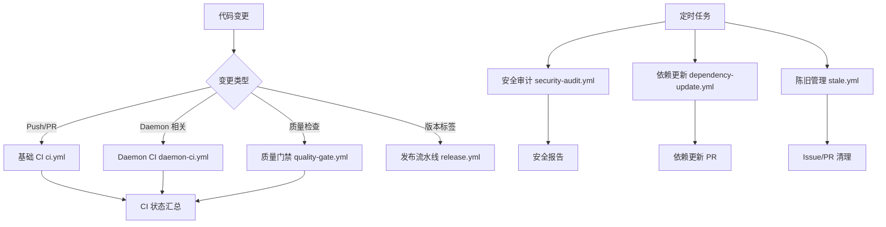

# 🚀 AgentOS GitCode 配置模块

**版本**: 3.0.0 (2026-04-07)  
**状态**: 生产就绪 (Production Ready)  
**定位**: AgentOS 项目的 GitCode/GitHub/Gitee 平台 CI/CD 配置中心

---

## 📋 模块概述

`.gitcode` 模块是 AgentOS 项目在 GitCode（及 GitHub/Gitee）平台上的配置中心，负责管理：

1. **CI/CD 流水线** - 自动化构建、测试、部署
2. **代码质量管理** - 质量门禁、静态分析、复杂度检查
3. **安全合规** - 安全扫描、漏洞检测、合规检查
4. **协作流程** - PR/Issue 模板、代码审查、自动化工作流
5. **发布管理** - 版本发布、包发布、Docker 镜像构建

### 🔄 版本历史

| 版本 | 日期 | 主要改进 |
|------|------|----------|
| **V1.0** | 2026-03-15 | 初始版本，基础 CI/CD 配置 |
| **V2.0** | 2026-04-06 | 全面优化，多平台支持，质量门禁 |
| **V3.0** | 2026-04-07 | 深度优化，架构原则集成，AI辅助 |

### 🎯 设计原则

1. **统一配置** - 三平台（GitCode/GitHub/Gitee）配置保持一致
2. **模块化设计** - 每个工作流专注单一职责
3. **质量内建** - 质量检查嵌入 CI/CD 流水线
4. **安全优先** - 安全扫描自动化、常态化
5. **开发者友好** - 清晰的模板、详细的文档

---

## 📂 目录结构

```
.gitcode/
├── 📄 README.md                   # 本文件
├── 📄 CODEOWNERS                  # 代码所有权定义
├── 📄 PULL_REQUEST_TEMPLATE.md    # PR 模板 (V4.0)
├── 📁 ISSUE_TEMPLATE/             # Issue 模板
│   ├── 📄 config.yml              # Issue 配置
│   ├── 📄 bug_report.md           # Bug 报告模板
│   └── 📄 feature_request.md      # 功能建议模板
└── 📁 workflows/                  # CI/CD 工作流
    ├── 📄 ci.yml                  # 基础 CI 流水线 (V3.0)
    ├── 📄 daemon-ci.yml           # Daemon 专项 CI (V2.0)
    ├── 📄 quality-gate.yml        # 质量门禁 (V2.0)
    ├── 📄 release.yml             # 发布流水线 (V2.0)
    ├── 📄 security-audit.yml      # 安全审计 (V2.0)
    ├── 📄 dependency-update.yml   # 依赖更新 (V1.0)
    ├── 📄 manager-enhanced-tests.yml # Manager 增强测试
    ├── 📄 stale.yml               # 陈旧 Issue/PR 管理 (V2.0)
    ├── 📄 build-desktop.yml       # 桌面客户端构建
    ├── 📄 heapstore-ci.yml        # Heapstore 模块 CI
    ├── 📄 openlab-ci.yml          # OpenLab 模块 CI
    ├── 📄 toolkit-go-ci.yml       # Go SDK CI
    ├── 📄 toolkit-python-ci.yml   # Python SDK CI
    ├── 📄 toolkit-rust-ci.yml     # Rust SDK CI
    ├── 📄 toolkit-typescript-ci.yml # TypeScript SDK CI
    ├── 📄 tests-deploy.yml        # 测试部署
    ├── 📄 tests-release.yml       # 测试发布
    └── 📄 tests-test.yml          # 测试流程
```

---

## 🔧 工作流详解

### 1. 基础 CI 流水线 (`ci.yml`)

**版本**: V3.0  
**触发条件**: Push 到 main/develop 分支，PR 到 main/develop  
**主要功能**:
- 统一 CI 流水线（调用 `scripts/ci/ci-run.sh`）
- 文档覆盖率检查
- CI 状态汇总

**关键特性**:
- ✅ 统一调用主编排脚本
- ✅ 集中管理 CI/CD 逻辑
- ✅ 支持模块化构建和并行化执行
- ✅ 完整的质量门禁和报告生成

### 2. Daemon 专项 CI (`daemon-ci.yml`)

**版本**: V2.0  
**触发条件**: Push 到 feature/**/bugfix/** 分支  
**主要功能**:
- 多平台构建（Linux/Windows/macOS）
- 静态分析（cppcheck）
- 构建时间统计

**支持平台**:
- 🐧 Linux (Ubuntu 22.04/24.04)
- 🪟 Windows (MSVC + vcpkg)
- 🍎 macOS (Apple Clang + Homebrew)

### 3. 质量门禁 (`quality-gate.yml`)

**版本**: V2.0  
**定位**: 高级质量分析（与基础 CI 分离）  
**主要功能**:
- 代码复杂度深度分析
- 代码度量指标统计
- Manager 模块专项测试
- 质量趋势追踪
- 技术债务识别

**检查项**:
- 🔍 复杂度分析（函数长度、圈复杂度）
- 🧪 Manager 模块测试
- 📝 文档覆盖率检查（增强版）
- 🎯 质量门禁决策

### 4. 发布流水线 (`release.yml`)

**版本**: V2.0  
**触发条件**: 推送版本标签（v*.*.*）  
**主要功能**:
- 多组件构建（内核、Python/Go/Rust SDK）
- Docker 镜像构建和推送
- GitHub Release 创建
- PyPI 发布（仅稳定版）

**发布类型**:
- 🏷️ **稳定版**: `v1.0.0`
- 🔧 **候选版**: `v1.0.0-rc.1`
- 🧪 **测试版**: `v1.0.0-beta.1`

### 5. 安全审计 (`security-audit.yml`)

**版本**: V2.0  
**触发条件**: 每天 UTC 02:00，手动触发  
**主要功能**:
- 依赖漏洞扫描（Trivy + Grype 双引擎）
- 容器镜像安全扫描
- CodeQL 高级静态分析
- 密钥和敏感信息检测（Gitleaks）
- SAST 静态应用安全测试（cppcheck）

**扫描范围**:
- 📦 依赖漏洞
- 🐳 容器镜像
- 🔐 代码安全
- 🕵️ 敏感信息泄露

### 6. 其他工作流

| 工作流 | 版本 | 功能 |
|--------|------|------|
| **dependency-update.yml** | V1.0 | 自动化依赖更新，创建 PR |
| **manager-enhanced-tests.yml** | V1.0 | Manager 模块增强测试 |
| **stale.yml** | V2.0 | 陈旧 Issue/PR 管理 |

---

## 📄 模板系统

### 1. Pull Request 模板 (`PULL_REQUEST_TEMPLATE.md`)

**版本**: V4.0 (2026-04-07)  
**特点**:
- 🎯 快速导航，预计用时指引
- 🏗️ 深度集成五维正交原则 V1.8
- 🤖 AI 辅助审查模块
- ⚡ 性能基准测试部分
- 🔒 安全审查专项
- ✅ 自动化检查结果集成

**主要章节**:
1. 核心信息（PR 类型、优先级）
2. 变更详情（问题背景、解决方案）
3. 质量检查（代码质量、测试覆盖）
4. 架构原则检查（五维正交系统）
5. AI 辅助审查
6. 性能基准
7. 安全审查
8. 审查流程

### 2. Issue 模板系统

#### Bug 报告模板 (`bug_report.md`)
- 🐛 标准化 Bug 描述格式
- 🖥️ 完整环境信息收集
- 🏗️ 架构影响分析（五维正交原则）
- 🛠️ 建议修复方案

#### 功能建议模板 (`feature_request.md`)
- 🎯 结构化功能描述
- 📋 架构对齐检查
- 🔍 实现考虑（性能、安全、兼容性）
- ✅ 检查清单

#### Issue 配置 (`config.yml`)
- 📞 联系信息（安全漏洞报告、架构问题）
- 🏷️ 标签管理（bug、enhancement、security 等）
- 🔄 自动分配规则

### 3. 代码所有权 (`CODEOWNERS`)

**版本**: 1.0.0  
**覆盖范围**:
- 核心内核层（corekern、coreloopthree、memoryrovol）
- 安全穹顶（cupolas）
- 服务层（daemon）
- 基础支撑层（commons）
- 多语言 SDK（Python/Go/Rust/TypeScript）
- 开放生态（openlab）
- 构建与部署脚本（scripts）
- 测试套件（tests）

**设计原则**:
1. 明确责任边界
2. 支持团队协作
3. 遵循五维正交原则

---

## 🔄 工作流触发关系



---

## 🛠️ 配置与自定义

### 环境变量

| 变量 | 默认值 | 描述 |
|------|--------|------|
| `BUILD_TYPE` | `Release` | 构建类型 |
| `CI_MODULE` | `all` | 构建模块 |
| `CI_PARALLEL` | `auto` | 并行构建数 |
| `GO_VERSION` | `1.22` | Go 版本 |
| `PYTHON_VERSION` | `3.11` | Python 版本 |

### 密钥管理

**必需密钥**:
- `GITHUB_TOKEN` - GitHub API 访问令牌（自动提供）
- `DOCKER_HUB_TOKEN` - Docker Hub 访问令牌（发布用）
- `PYPI_API_TOKEN` - PyPI API 令牌（Python 包发布）

**可选密钥**:
- `GITLEAKS_LICENSE` - Gitleaks 许可证
- 其他第三方服务令牌

### 平台适配

**三平台一致性**:
- GitCode: `.gitcode/` 目录
- GitHub: `.github/` 目录（符号链接或复制）
- Gitee: `.gitee/` 目录（符号链接或复制）

**维护脚本**: `scripts/ci/sync-platform-configs.sh`

---

## 📈 监控与优化

### 性能指标

| 指标 | 目标 | 监控方式 |
|------|------|----------|
| **构建时间** | < 45分钟 | CI 时间统计 |
| **测试覆盖率** | ≥ 90% | 覆盖率报告 |
| **代码复杂度** | CC < 10 | 复杂度分析 |
| **安全漏洞** | 0 关键/高危 | 安全扫描 |

### 优化策略

1. **缓存优化**
   - apt/pip 依赖缓存
   - CMake 构建缓存
   - Docker 层缓存

2. **并行执行**
   - 多平台并行构建
   - 测试并行执行
   - 工作流作业并行

3. **增量检查**
   - 仅检查变更文件
   - 缓存分析结果
   - 增量测试

---

## 🚀 快速开始

### 1. 首次配置

```bash
# 克隆仓库
git clone https://gitcode.com/spharx/agentos.git

# 检查配置
cd agentos/.gitcode
ls -la workflows/

# 验证配置
# （确保有相应的权限和密钥配置）
```

### 2. 手动触发工作流

**通过 GitCode Web 界面**:
1. 进入仓库页面
2. 点击 "Actions" 标签
3. 选择相应工作流
4. 点击 "Run workflow"

**通过 API**:
```bash
# 示例：触发安全审计
curl -X POST \
  -H "Authorization: token $GITHUB_TOKEN" \
  -H "Accept: application/vnd.github.v3+json" \
  https://api.github.com/repos/spharx/agentos/actions/workflows/security-audit.yml/dispatches \
  -d '{"ref":"main"}'
```

### 3. 问题排查

**常见问题**:
1. **构建失败**: 检查依赖安装、缓存状态
2. **测试超时**: 调整超时设置，优化测试用例
3. **安全检查误报**: 调整扫描敏感度，添加例外
4. **配置不一致**: 运行同步脚本更新三平台配置

**日志位置**:
- CI/CD 运行日志: GitCode/GitHub Actions 界面
- 构建日志: `build-*/CMakeFiles/*.log`
- 测试报告: `build-*/Testing/`
- 安全报告: 工作流制品

---

## 🔮 未来规划

### 短期改进 (Q2 2026)
- [ ] **智能缓存** - 基于代码变更的智能缓存策略
- [ ] **AI 代码审查** - 集成 AI 辅助代码审查
- [ ] **性能基准数据库** - 历史性能数据追踪
- [ ] **合规自动化** - 自动化合规检查

### 中期规划 (Q3-Q4 2026)
- [ ] **多云部署** - 支持 AWS、Azure、GCP 部署
- [ ] **移动端构建** - iOS/Android 跨平台构建
- [ ] **区块链集成** - 代码签名、审计追踪
- [ ] **量子安全** - 后量子密码学支持

### 长期愿景 (2027+)
- [ ] **自主运维** - AI 驱动的自主 CI/CD 优化
- [ ] **预测性分析** - 基于机器学习的故障预测
- [ ] **元宇宙集成** - 虚拟开发环境
- [ ] **量子计算** - 量子算法测试和验证

---

## 📞 支持与贡献

### 获取帮助

1. **文档**: 查看 [AgentOS 文档](../docs/)
2. **Issue**: 提交 [Bug 报告](./ISSUE_TEMPLATE/bug_report.md)
3. **讨论**: 参与 [GitCode Discussions](https://gitcode.com/spharx/agentos/discussions)
4. **安全**: 报告 [安全漏洞](../SECURITY.md)

### 贡献指南

1. **代码规范**: 遵循 [CODING_STANDARDS.md](../docs/Capital_Specifications/)
2. **架构原则**: 遵循 [ARCHITECTURAL_PRINCIPLES.md](../docs/ARCHITECTURAL_PRINCIPLES.md) V1.8
3. **提交 PR**: 使用 [PR 模板](./PULL_REQUEST_TEMPLATE.md)
4. **代码审查**: 遵循 [审查流程](../CONTRIBUTING.md#code-review)

### 维护团队

- **核心团队**: @spharx-team/core
- **架构团队**: @spharx-team/architecture
- **安全团队**: @spharx-team/security
- **运维团队**: @spharx-team/devops

---

## 📜 许可证

本配置模块遵循 [AgentOS 项目许可证](../LICENSE)。

---

> **"始于数据，终于智能。"**  
> *"From data intelligence emerges."*  
> AgentOS GitCode 配置模块 - 为智能涌现提供坚实的工程基础 🚀