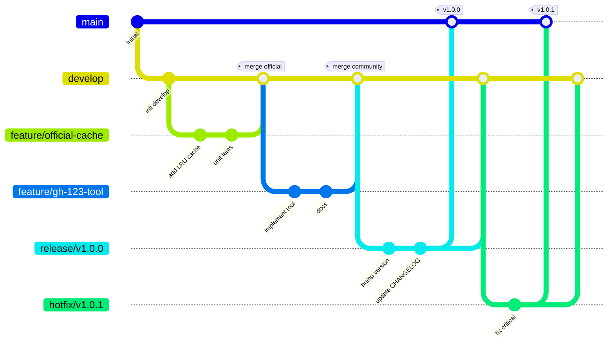

# 贡献指南 CONTRIBUTING GUIDE

感谢您对 AgentOS 项目感兴趣！我们欢迎各种形式的贡献，包括代码提交、文档改进、问题报告和功能建议。

**版本**：v1.0.0.6  
**最后更新**：2026-03-21

## 📋 目录

- [行为准则](#行为准则)
- [快速导航](#快速导航)
- [开发环境设置](#开发环境设置)
- [分支模型](#分支模型)
- [贡献流程](#贡献流程)
- [代码规范](#代码规范)
- [测试要求](#测试要求)
- [提交规范](#提交规范)
- [审查与合并](#审查与合并)
- [常见问题](#常见问题)
- [认可与致谢](#认可与致谢)
- [联系方式](#联系方式)

---

## 行为准则

本项目采用 **Contributor Covenant** 作为行为准则。请确保您的行为符合准则要求，共同维护友好、包容的社区环境。

---

## 快速导航

- 🐛 [报告 Bug (Gitee 官方)](https://gitee.com/spharx/agentos/issues)
- 💡 [提出功能建议 (Gitee 官方)](https://gitee.com/spharx/agentos/issues)
- 📖 [查看文档](./partdocs/)
- 💬 [参与讨论 (GitHub 镜像)](https://github.com/SpharxTeam/AgentOS/discussions)
- 📄 [技术规范](./partdocs/specifications/)
- 🧪 [测试指南](./tests/README.md)

---

## 开发环境设置

### 1. 环境要求

- **操作系统**：Linux (Ubuntu 22.04+), macOS 13+, Windows 11 (WSL2)
- **编译器**：GCC 11+ 或 Clang 14+
- **构建工具**：CMake 3.20+, Ninja 或 Make
- **Python**: 3.9+
- **依赖库**（通过系统包管理器安装）：
  - OpenSSL >= 1.1.1
  - libevent >= 2.1
  - FAISS >= 1.7.0
  - SQLite3 >= 3.35
  - libcurl >= 7.68
  - cJSON >= 1.7.15

### 2. Fork 和克隆项目

# 1. 在 Gitee/GitHub 上 Fork 本项目
#    官方仓库：https://gitee.com/spharx/agentos
#    镜像仓库：https://github.com/spharx-team/AgentOS
#
# 2. 克隆您的 fork
git clone https://gitee.com/YOUR_USERNAME/agentos.git
cd agentos

# 或克隆 GitHub 镜像
git clone https://github.com/YOUR_USERNAME/AgentOS.git
cd AgentOS

# 3. 添加上游仓库（二选一）
git remote add upstream https://gitee.com/spharx/agentos.git
# 或
git remote add upstream https://github.com/SpharxTeam/AgentOS.git

### 3. 安装依赖

#### 使用 Poetry（推荐，用于 Python 部分）

```bash
# 安装 Poetry
curl -sSL https://install.python-poetry.org | python3 -

# 安装依赖
poetry install

# 激活虚拟环境
poetry shell
```

#### 使用 pip

```bash
# 创建虚拟环境
python3 -m venv venv
source venv/bin/activate  # Linux/macOS
# 或 .\venv\Scripts\activate  # Windows

# 安装依赖
pip install -e .
pip install -e ".[dev]"
```

### 4. 构建内核（C 语言部分）

```bash
mkdir build && cd build
cmake ../atoms -DCMAKE_BUILD_TYPE=Debug -DBUILD_TESTS=ON
make -j$(nproc)
```

### 5. 配置预提交钩子

```bash
# 安装 pre-commit
pre-commit install

# 验证安装
pre-commit --version
```

### 6. 验证环境

```bash
# 运行环境验证脚本
./validate.sh

# 或快速体验
./quickstart.sh
```

---

## 分支模型

AgentOS 采用 **简洁、开放、稳健** 的分支模型；

仅保留两条永久分支，其余均为临时分支，便于社区协作。

作为一个开源项目，要非常的优雅 Purism “Simplicity is the ultimate sophistication.”

- 对称：社区与官方开发流程完全一致，无特权分支。
- 清晰：分支命名语义化，一眼可知用途。
- 稳定：main 始终保持纯净，develop 始终可集成。
- 追溯：所有合并使用 PR，历史清晰。
- 友好：贡献者只需关注 develop 和 feature/*，无需理解复杂模型。

### 分支类型与生命周期

| 分支类型 | 命名示例 | 起点 | 终点 | 说明 |
| :--- | :--- | :--- | :--- | :--- |
| **main** | `main` | 初始提交 | 永久 | 生产版本基线，仅通过 `release/*` 和 `hotfix/*` 合并更新 |
| **develop** | `develop` | 从 main 分出 | 永久 | 日常开发集成分支，所有功能分支的汇集点 |
| **官方功能分支** | `feature/official-<desc>` | 从 develop 分出 | 合并回 develop | 官方团队新功能开发 |
| **社区功能分支** | `feature/gh-<issue>-<desc>` | 从 develop 分出 | 合并回 develop | 社区贡献，关联 Issue 编号 |
| **发布分支** | `release/v<major>.<minor>.<patch>` | 从 develop 分出 | 合并到 main 和 develop | 版本发布前的稳定化 |
| **热修复分支** | `hotfix/v<major>.<minor>.<patch>` | 从 main 分出 | 合并到 main 和 develop | 紧急修复生产版本问题 |

### 分支示意图



### 分支保护规则

- **main**：禁止直接推送；仅允许通过 Pull Request 从 `release/*` 或 `hotfix/*` 合并，必须通过 CI 和至少一名核心维护者批准。
- **develop**：禁止直接推送；仅允许通过 Pull Request 从 `feature/*`、`release/*`、`hotfix/*` 合并，必须通过 CI。
- **release/\***：允许核心维护者直接推送（用于版本稳定化）。
- **hotfix/\***：允许核心维护者直接推送（用于紧急修复）。

---

## 贡献流程

### 1. 选择 Issue

- 查看 [Gitee Issues](https://gitee.com/spharx/agentos/issues)（官方，首选）或 [GitHub Issues](https://github.com/SpharxTeam/AgentOS/issues)（镜像）
- 寻找标记为 `good first issue` 或 `help wanted` 的问题
- 在 Issue 下评论表示您要接手，避免重复工作

### 2. 创建分支

```bash
# 从最新的 develop 分支创建功能分支
git checkout develop
git pull upstream develop

git checkout -b feature/gh-123-add-memory-cache   # 社区贡献
# 或
git checkout -b feature/official-llm-streaming   # 官方开发者
```

**分支命名规范**：
- `feature/gh-<issue 编号>-<简短描述>` – 社区贡献
- `feature/official-<简短描述>` – 官方开发
- `fix/gh-<issue 编号>-<简短描述>` – 修复（非紧急，一般也走 feature）
- `hotfix/v<版本号>` – 紧急修复（直接创建，不通过 PR 机制）

### 3. 进行修改

- 编写代码和测试
- 更新相关文档（`partdocs/` 下对应文档）
- 确保代码符合项目规范（见 [代码规范](#代码规范)）
- 运行测试确保不影响现有功能
- 参考 [scripts/README.md](scripts/README.md) 使用开发和运维脚本

### 4. 提交更改

```bash
# 添加文件
git add .

# 提交（遵循提交规范）
git commit -m "feat(memory): add FAISS vector index support"

# 推送分支到远程
git push origin feature/gh-123-add-memory-cache
```

### 5. 创建 Pull Request

- 在 Gitee 或 GitHub 上访问您的 fork
- 点击 "Compare & pull request"
- 选择目标分支为 `develop`
- 填写 PR 模板（包含变更摘要、测试情况、关联 Issue 等）
- 等待 CI 检查通过
- 请求维护者审查（可 @ 相关维护者）

### 6. 代码审查

- 回应审查意见，进行必要的修改
- 保持讨论礼貌、建设性
- 获得至少一名核心维护者批准后即可合并

### 7. 合并与清理

- 维护者将使用 **Squash and Merge** 或 **Rebase and Merge** 保持历史整洁
- 合并后，您可以在本地删除功能分支：`git branch -d feature/gh-123-add-memory-cache`

---

## 代码规范

### 通用规则

- **注释**：关键逻辑、公共接口必须有清晰注释
- **命名**：使用有意义的英文名，避免缩写
- **错误处理**：所有可能失败的调用必须检查返回值

### C/C++ 代码（内核、服务、安全层）

遵循 **AgentOS C 语言编码规范 v1.0.1**，要点：

- **命名**：变量、函数小写蛇形（`snake_case`）；类型以 `_t` 结尾；宏全大写。
- **文件组织**：头文件仅暴露必要接口，内部结构使用不透明指针。
- **函数长度**：单个函数不超过 50 行。
- **资源管理**：谁分配谁释放，使用 `goto fail` 模式统一清理错误路径。
- **错误码**：使用 `agentos_error_t` 统一错误码，记录日志。

**格式化**：
```bash
clang-format -i src/**/*.c src/**/*.h
```

### Python 代码（脚本、工具）

遵循 **PEP 8** 和 **Google Python Style Guide**：

# 好的示例
def calculate_similarity(query: str, documents: list[str]) -> float:
    """计算查询与文档列表的相似度"""
    if not documents:
        return 0.0

    # 实现逻辑
    pass


class MemoryIndex:
    """记忆索引管理类"""

    def __init__(self, dimension: int):
        self.dimension = dimension

**格式化**：
```bash
black .
isort .
```

### 文档规范

- 使用 Markdown，代码块标注语言
- 示例代码要完整可运行
- 必要时配图（使用 Mermaid 绘制架构图）

---

## 测试要求

### 编写测试

#### 单元测试（C 语言）

使用 `cmocka` 框架，测试文件放在 `tests/unit/` 下，命名 `test_<module>.c`：

```c
#include <stdarg.h>
#include <stddef.h>
#include <setjmp.h>
#include <cmocka.h>
#include "cache.h"

static void test_cache_create(void **state) {
    cache_t *cache = cache_create(10, 60);
    assert_non_null(cache);
    cache_destroy(cache);
}

int main(void) {
    const struct CMUnitTest tests[] = {
        cmocka_unit_test(test_cache_create),
    };
    return cmocka_run_group_tests(tests, NULL, NULL);
}
```

#### 单元测试（Python）

使用 `pytest`：

```python
# tests/unit/test_memory.py
import pytest
from agentos.memory import MemoryIndex


class TestMemoryIndex:
    def test_create_index(self):
        index = MemoryIndex(dimension=768)
        assert index.dimension == 768

    def test_add_vectors(self):
        index = MemoryIndex(dimension=768)
        vectors = [[0.1] * 768, [0.2] * 768]
        index.add(vectors)
        assert index.size() == 2
```

### 运行测试

```bash
# 运行所有测试
make test

# 运行 C 单元测试
cd build && ctest --output-on-failure

# 运行 Python 单元测试
pytest tests/unit/

# 运行集成测试
pytest tests/integration/

# 生成覆盖率报告
pytest --cov=agentos --cov-report=html
```

### 测试覆盖率要求

- 新功能必须包含单元测试
- 核心模块（`atoms/`、`backs/`）行覆盖率 > 80%
- 关键路径（如系统调用、记忆检索）覆盖率 > 90%

---

## 提交规范

遵循 **Conventional Commits** 规范，便于自动生成 CHANGELOG。

### 格式

<type>(<scope>): <subject>

<body>

<footer>

### Type 类型

| 类型 | 说明 |
| :--- | :--- |
| `feat` | 新功能 |
| `fix` | Bug 修复 |
| `docs` | 文档更新 |
| `style` | 代码格式调整（不影响功能） |
| `refactor` | 代码重构（不改变功能） |
| `perf` | 性能优化 |
| `test` | 测试相关 |
| `chore` | 构建/工具/依赖更新 |
| `revert` | 回滚提交 |

### Scope 范围（可选）

常用 scope：
- `kernel` – 内核相关（corekern, coreloopthree）
- `memory` – 记忆系统（memoryrovol）
- `llm` – LLM 服务
- `tool` – 工具服务
- `sdk` – SDK 相关
- `docs` – 文档
- `scripts` – 脚本工具

### 示例

```bash
# 新功能
feat(memory): add FAISS IVF index support

# Bug 修复
fix(scheduler): resolve race condition in task queue

# 性能优化
perf(retrieval): reduce memory copy in attractor network

# 文档更新
docs(readme): update installation instructions for macOS

# 重构
refactor(core): extract memory management to separate class
```

---

## 审查与合并

### Pull Request 审查标准

- **正确性**：代码逻辑正确，测试通过
- **可读性**：命名清晰，注释充分，结构合理
- **兼容性**：不破坏现有 API 和接口
- **性能**：无明显性能回退
- **测试覆盖**：新功能有相应测试

### 合并策略

- 使用 **Squash and Merge**（将多个提交合并为一个，保持历史整洁）
- 合并信息自动采用 PR 标题和描述
- 合并后关闭关联的 Issue

### 快速路径（仅核心维护者）

- 文档类修改（仅改动 `.md` 文件）可直接合并，无需等待 CI 完成。
- 微小修复（如错别字、格式）可由核心维护者自行提交到 `develop` 并快速合并。

---

## 常见问题

**Q: 如何开始第一个贡献？**  
A: 从简单的任务开始，例如：
- 修复文档中的拼写错误
- 改进错误消息
- 添加单元测试
- 优化性能瓶颈

**Q: 遇到问题怎么办？**  
A: 可以通过以下方式获取帮助：
- 查看现有文档（`partdocs/`）
- 在 Issue 中提问（最好关联到具体问题）
- 在 [Discussions](https://github.com/SpharxTeam/AgentOS/discussions) 中讨论
- 查阅 [scripts/](scripts/) 目录下的开发和运维脚本
- 联系维护者（见联系方式）

**Q: 多久能得到回复？**  
A: 我们承诺：
- Issue: 48 小时内回复
- PR: 5 个工作日内审查
- 问题咨询：尽快回复

**Q: 可以提交破坏性变更吗？**  
A: 破坏性变更需要：
- 提前在 Issue 中讨论
- 提供迁移指南
- 获得至少 2 个维护者批准
- 在主版本更新时引入

**Q: 我是否需要签署 CLA？**  
A: 目前无需签署 CLA。贡献者只需遵守项目许可（Apache 2.0），保留版权声明。

**Q: 代码格式不一致怎么办？**  
A: 我们使用 `pre-commit` 自动检查格式。提交前运行 `pre-commit run --all-files` 可手动修复大部分格式问题。

---

## 认可与致谢

所有贡献者将被列入 `AUTHORS.md`，并在 `CHANGELOG.md` 中被提及（若贡献在版本中体现）。

重要贡献还将被：
- 在官方博客中介绍
- 邀请成为核心贡献者
- 获得项目纪念品（可选）

---

## 联系方式

- **Gitee Issues**: https://gitee.com/spharx/agentos/issues (官方，首选)
- **GitHub Issues**: https://github.com/SpharxTeam/AgentOS/issues (镜像)
- **技术支持**: lidecheng@spharx.cn
- **安全问题**: wangliren@spharx.cn
- **商务合作**: zhouzhixian@spharx.cn
- **官方网站**: https://spharx.cn

### 仓库链接

- **官方仓库**: https://gitee.com/spharx/agentos
- **镜像仓库**: https://github.com/SpharxTeam/AgentOS

**感谢您的贡献！** 🎉

<div align="center">

**SPHARX 极光感知科技**

*From data intelligence emerges*

</div>

© 2026 SPHARX Ltd. 保留所有权利。
