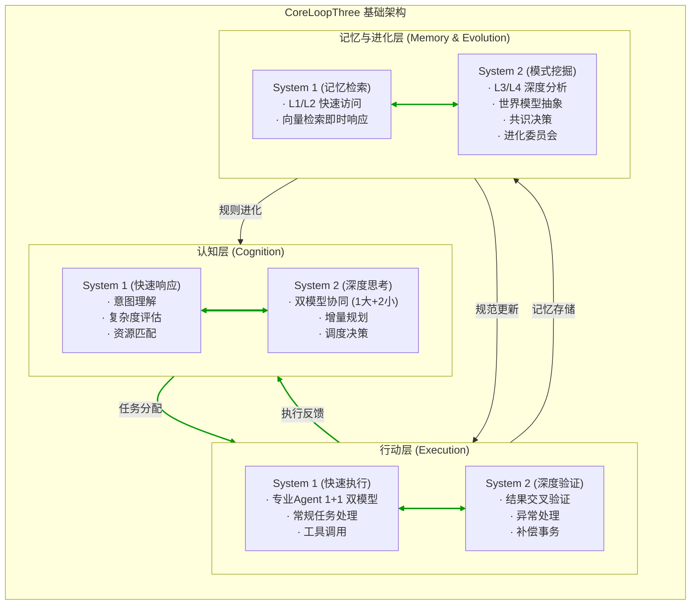
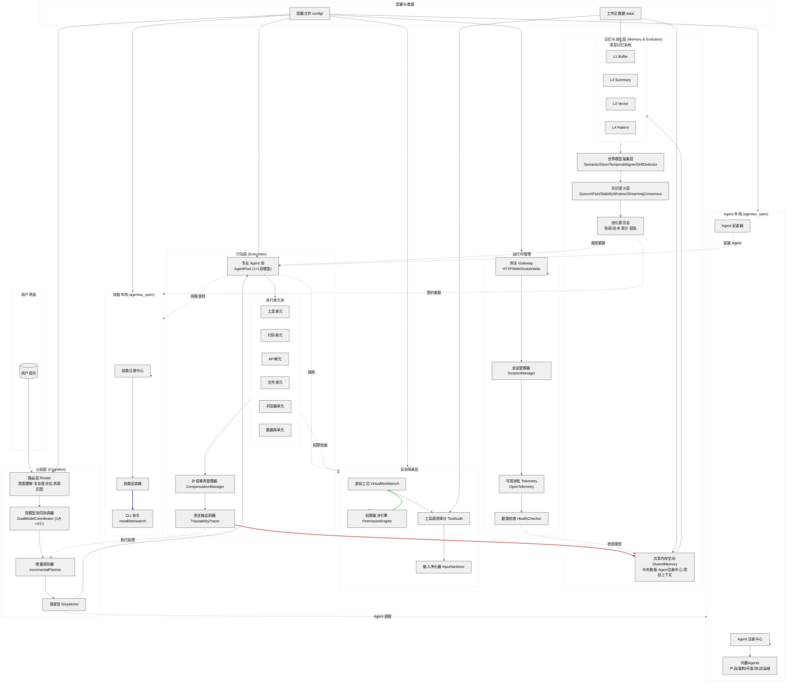

# AgentOS

<p align="center">
  
  
  
  <a href="https://arxiv.org/abs/2602.20934"></a>
</p>

<p align="center">
  <strong>AgentOS</strong> —— 一个基于 CoreLoopThree 架构的智能体操作系统。<br>
  让 AI 团队像人类组织一样协作：认知、行动、记忆与进化，三层一体，持续自驱。
</p>

## 📖 项目简介

- AgentOS 是一个面向未来的智能体操作系统框架。
- 它不再依赖单个超级智能体解决复杂问题，而是通过动态组建专业智能体团队，将工程控制的反馈思想与系统工程的层次分解方法相结合，实现“认知‑行动‑记忆与进化”三层一体的自动化协作。

我们融合了相关领域的最新研究成果：

*   **双系统协同**（卡尼曼 System 1/System 2）
*   **共识语义层**（Quorum‑fast 决策、Streaming 共识）
*   **世界模型抽象**（语义切片、时间对齐、认知漂移检测）
*   **技能市场**（独立安装、版本管理、依赖解析）
*   **安全内生**（虚拟工位、权限裁决、输入净化）

AgentOS 的目标是：当你说“开发一个电商应用”时，系统不是调用一个超级智能体去写代码，而是自动组建一个团队——产品经理理解需求、架构师设计系统、前后端分工协作、测试工程师保障质量、运维工程师负责部署。这个团队会自我管理、自我进化，而你只需给出指令，等待结果。

## ✨ 核心特性

### 🔁 三层一体（CoreLoopThree）

*   **认知层**：意图理解、双模型协同（1 大 +2 小冗余）、增量规划、动态调度。
*   **行动层**：专业 Agent 池（1+1 双模型简配）、可验证执行单元、补偿事务、责任链追踪。
*   **记忆与进化层**：深层记忆（L1‑L4）、世界模型抽象、共识语义层、四委员会（协调/技术/审计/团队）。



### 🧠 双系统理论工程化

*   每个智能体均内嵌 **System 1（快速响应）** 与 **System 2（深度思考）**，实现自我纠错与交叉验证。
*   认知层采用 **1 主 + 2 辅冗余架构**，确保高可用。

### ⚡ Token 效率最大化

*   **分层记忆**（Buffer → Summary → Vector → Pattern），高成本仅用于当前轮次。
*   **Streaming 共识**：Token 生成过程中持续检测共识，满足条件立即终止，节省 1.1‑4.4 倍 Token。
*   **Quorum-fast 决策**：不等待全体，延迟降低 20 倍。
*   **语义切片**：将上下文窗口视为可寻址语义空间，按需加载历史片段。

### 🧩 动态团队组建（角色市场）

- **Agent 契约**：机器可读的能力描述（输入输出 Schema、成本预估、信任指标）。
- **注册中心**：SQLite 存储所有 Agent 元数据，支持多目标优化调度。
- **调度官**：根据任务需求，自动组建临时团队，任务结束即解散。
- **内置Agent**：产品经理、架构师、前端开发、后端开发、测试工程师、DevOps 工程师
- **社区 Agent**：支持社区开发和贡献第三方 Agent

### 🛠️ 技能市场（Skill Market）

- **独立模块**：位于 `agentos_open/markets/skill/`，与内核解耦。
- **多源支持**：从 GitHub、本地、官方源安装技能。
- **技能契约**：定义依赖、权限、版本，自动解析依赖。
- **命令式管理**：
  ```bash
  agentos skill install <skill-name>    # 安装技能
  agentos skill list                     # 列出已安装技能
  agentos skill search <query>           # 搜索技能
  agentos skill uninstall <name>         # 卸载技能
  ```

### 🔒 安全内生

*   **虚拟工位**：每个 Agent 运行在独立沙箱，与用户真实设备隔离。
*   **权限裁决引擎**：基于规则（非 LLM）判断操作权限，最小权限原则。
*   **工具调用审计**：记录所有工具调用，支持异常检测与追溯。
*   **输入净化器**：过滤恶意输入，防止提示词注入。

### 🌍 世界模型抽象层

*   **语义切片**：将上下文切分为可索引的语义块。
*   **时间对齐**：确保多 Agent 间的时序一致性。
*   **认知漂移检测**：识别并修正 Agent 对同一事实的理解偏差。

### 📊 生产级可观测性

*   OpenTelemetry 集成，分布式追踪。
*   p95 延迟监控，Token 独特性预测。
*   健康检查（`agentos doctor`）一键诊断。

## 🧬 架构总览

### 整体结构

```
AgentOS/
├── agentos_cta/                 # 🔵 内核（CoreLoopThree）- 不可变核心
│   ├── coreloopthree/           # 认知 - 行动 - 记忆与进化三层
│   │   ├── cognition/           # 路由、双模型、规划、调度
│   │   ├── execution/           # Agent 池、执行单元、补偿、追踪
│   │   └── memory_evolution/    # 深层记忆、世界模型、共识、委员会
│   ├── runtime/                 # 网关、会话、遥测、健康检查
│   ├── saferoom/                # 安全隔离层（虚拟工位、权限、审计）
│   └── utils/                   # 工具集（成本、延迟、Token）
│
├── agentos_open/                # 🔥 开放生态（可扩展）
│   ├── markets/
│   │   ├── agent/               # Agent 市场
│   │   │   ├── builtin/         # 内置Agent（产品/架构/开发/测试）
│   │   │   ├── registry/        # Agent 注册中心
│   │   │   ├── installer/       # Agent 安装器
│   │   │   └── contracts/       # Agent 契约规范
│   │   └── skill/               # 技能市场
│   │       ├── commands/        # CLI (install/list/search)
│   │       ├── registry/        # 技能注册中心
│   │       ├── installer/       # 技能安装器
│   │       └── contracts/       # 技能契约规范
│   └── contrib/                 # 社区贡献
│       ├── agents/              # 社区 Agent
│       └── skills/              # 社区技能
│
├── config/                      # 配置文件
├── docs/                        # 文档
├── examples/                    # 示例
├── tests/                       # 测试
├── scripts/                     # 工具脚本
├── pyproject.toml               # 项目配置
├── README.md
└── LICENSE
```

### 架构图



## 🚀 快速开始

### 安装

# 一键安装（Linux/macOS）
curl -fsSL https://agentos.org/install.sh | bash

# 或使用 pip
pip install agentos-cta

# 初始化配置
agentos init

### 启动服务

# 本地开发模式
agentos gateway start --port 18789

# 健康检查
agentos doctor

### 第一个示例：电商应用开发

# 克隆示例
git clone https://github.com/yourname/agentos-examples
cd agentos-examples/ecommerce_dev

# 运行（自动组建团队）
./run.sh

## 📚 文档

详细文档请访问：

- **[CoreLoopThree 架构详解](docs/architecture/CoreLoopThree.md)** - 深入理解三层一体设计
- **[Agent 契约规范](docs/specifications/agent_contract_spec.md)** - Agent 能力描述标准
- **[Skill 市场使用指南](docs/guides/create_skill.md)** - 创建和发布技能
- **[安全配置](docs/specifications/security_spec.md)** - 安全隔离与权限控制
- **[API 参考](docs/api/)** - 完整 API 文档
- **[部署指南](docs/guides/deployment.md)** - 生产环境部署
- **[性能优化](docs/guides/token_optimization.md)** - Token 效率最大化技巧
- **[故障排查](docs/guides/troubleshooting.md)** - 常见问题解答
- **[开放生态说明](agentos_open/README.md)** - Agent 市场和技能市场详解

## 🤝 贡献

我们热烈欢迎社区贡献！无论是提交 bug 报告、功能建议，还是贡献代码、Agent、Skill，请阅读我们的 [贡献指南](CONTRIBUTING.md)。

### 参与方式

- **开发环境搭建**：见 [开发者手册](docs/guides/getting_started.md)
- **代码贡献**：所有贡献需通过契约测试和审计委员会审查
- **Agent/Skill 开发**：参考 [agentos_open/README.md](agentos_open/README.md)
- **重大变更**：请先开 issue 讨论

## 📄 许可证

AgentOS 使用 GNU General Public License v3.0 开源。详见 [LICENSE](LICENSE) 文件。

## 🙏 致谢

AgentOS 的设计与实现离不开以下开源项目与学术研究的启发：

*   **OpenClaw** —— 技能市场与医生自检机制
*   **三省六部** —— 多智能体分工与治理思想
*   **Agent-Kernel** —— 模块化微内核架构
*   **CogniGUI** —— 双系统理论与 GRPO 机制
*   **Architecting AgentOS (arXiv:2602.20934)** —— 可寻址语义空间
*   **Agentic Consensus (arXiv:2512.20184)** —— 共识驱动早停与 Quorum‑fast 决策
*   **NVIDIA NeMo Agent Toolkit** —— Token 独特性预测与生产级实践
*   **女娲智能体 OS** —— 虚拟工位安全沙箱
*   **IETF ADOL 草案** —— 数据优化层设计


<p align="center">
  <sub>Built with ❤️ by the AgentOS community</sub>
</p>
