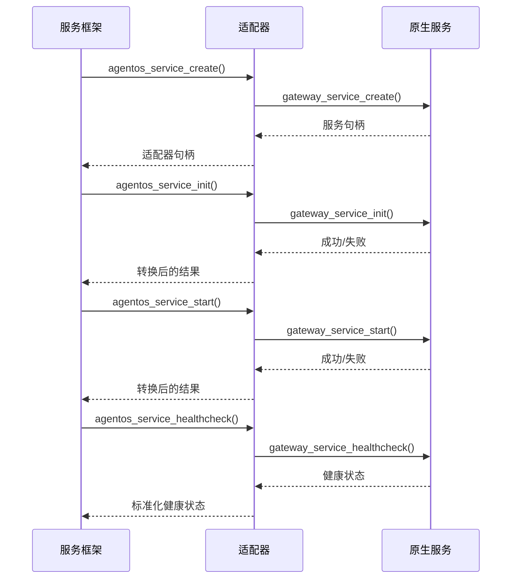

# AgentOS Daemon 服务适配器模式设计规范

**文档版本**: v1.0.0  
**最后更新**: 2026-04-11  
**所属阶段**: 第三阶段 - 系统完善（8月-9月）  
**文档状态**: ✅ 已完成设计

---

## 📋 概述

本文档定义了 AgentOS Daemon 服务适配器模式的设计规范，用于将现有的守护进程服务适配到统一的 AgentOS 服务管理框架中。适配器模式使现有服务能够享受统一的**生命周期管理、状态监控、健康检查、服务发现和统计收集**功能，而无需重写现有代码。

### 设计目标

1. **无缝集成**: 现有服务无需大规模修改即可接入服务管理框架
2. **向后兼容**: 保持现有 API 不变，不影响现有用户
3. **统一管理**: 所有服务通过标准化接口进行管理
4. **可扩展性**: 支持未来服务功能的扩展
5. **性能优化**: 适配层引入的最小性能开销

### 适配器模式优势

- **解耦合**: 服务实现与框架管理逻辑分离
- **可复用**: 通用适配器模板可用于多种服务类型
- **可测试**: 适配器层可以独立测试
- **渐进迁移**: 服务可以逐步迁移到新框架

---

## 🏗️ 适配器架构设计

### 三层适配架构

```
┌─────────────────────────────────────────────────┐
│           服务管理框架 (Service Framework)        │
│      agentos_service_*() 统一管理接口            │
├─────────────────────────────────────────────────┤
│             适配器层 (Adapter Layer)             │
│   ┌─────────────┐ ┌─────────────┐ ┌─────────────┐ │
│   │ Gateway适配器│ │  LLM适配器  │ │ Market适配器 │ │
│   └─────────────┘ └─────────────┘ └─────────────┘ │
├─────────────────────────────────────────────────┤
│           原生服务层 (Native Service Layer)       │
│   gateway_service_*()  llm_service_*()  ...     │
└─────────────────────────────────────────────────┘
```

### 适配器组件

| 组件 | 职责 | 实现方式 |
|------|------|----------|
| **适配器接口** | 实现 agentos_svc_interface_t | 静态函数集合 |
| **适配器上下文** | 存储原生服务句柄和配置 | 结构体封装 |
| **配置转换器** | 将通用配置转换为服务特定配置 | 转换函数 |
| **状态同步器** | 同步原生服务状态与框架状态 | 状态映射表 |
| **错误转换器** | 转换服务错误码为框架错误码 | 错误映射表 |

### 适配器工作流程



---

## 📝 适配器实现规范

### 1. 文件命名规范

| 文件类型 | 命名模式 | 示例 | 位置 |
|----------|----------|------|------|
| 适配器头文件 | `<service>_svc_adapter.h` | `gateway_svc_adapter.h` | `include/` |
| 适配器源文件 | `<service>_svc_adapter.c` | `gateway_svc_adapter.c` | `src/` |
| 适配器测试文件 | `test_<service>_adapter.c` | `test_gateway_adapter.c` | `tests/` |

### 2. 适配器上下文结构

```c
/**
 * @brief 服务适配器上下文
 */
typedef struct {
    /* 原生服务句柄 */
    void* native_service;          /**< 原生服务句柄（类型特定） */
    
    /* 配置信息 */
    agentos_svc_config_t common_config;    /**< 通用服务配置 */
    void* native_config;                   /**< 原生服务配置 */
    
    /* 状态信息 */
    agentos_svc_state_t framework_state;   /**< 框架感知的状态 */
    void* native_state;                    /**< 原生服务状态 */
    
    /* 统计信息 */
    agentos_svc_stats_t stats;             /**< 服务统计信息 */
    uint64_t last_healthcheck_time;        /**< 最后健康检查时间 */
    
    /* 适配器元数据 */
    char service_type[32];                 /**< 服务类型标识 */
    uint32_t adapter_version;              /**< 适配器版本 */
} service_adapter_ctx_t;
```

### 3. 适配器接口实现

```c
/**
 * @brief 服务适配器接口实现
 */
static const agentos_svc_interface_t gateway_adapter_interface = {
    .init = gateway_adapter_init,
    .start = gateway_adapter_start,
    .stop = gateway_adapter_stop,
    .destroy = gateway_adapter_destroy,
    .healthcheck = gateway_adapter_healthcheck,
};

/**
 * @brief 适配器初始化函数
 */
static agentos_error_t gateway_adapter_init(
    agentos_service_t service,
    const agentos_svc_config_t* config
) {
    service_adapter_ctx_t* ctx = get_adapter_context(service);
    
    // 1. 保存通用配置
    if (config) {
        memcpy(&ctx->common_config, config, sizeof(agentos_svc_config_t));
    }
    
    // 2. 转换为原生配置
    gateway_service_config_t native_config;
    convert_common_to_native_config(&ctx->common_config, &native_config);
    
    // 3. 创建原生服务
    agentos_error_t err = gateway_service_create(
        (gateway_service_t*)&ctx->native_service,
        &native_config
    );
    
    // 4. 初始化原生服务
    if (err == AGENTOS_SUCCESS) {
        err = gateway_service_init(ctx->native_service);
    }
    
    // 5. 更新框架状态
    if (err == AGENTOS_SUCCESS) {
        ctx->framework_state = AGENTOS_SVC_STATE_READY;
    } else {
        ctx->framework_state = AGENTOS_SVC_STATE_ERROR;
    }
    
    return err;
}
```

### 4. 配置转换规范

```c
/**
 * @brief 通用配置到原生配置转换
 */
static void convert_common_to_native_config(
    const agentos_svc_config_t* common,
    gateway_service_config_t* native
) {
    // 基础信息转换
    native->name = common->name ? common->name : "gateway_d";
    native->version = common->version ? common->version : "1.0.0";
    
    // 能力映射
    if (common->capabilities & AGENTOS_SVC_CAP_STREAMING) {
        native->ws.enabled = true;
    }
    
    if (common->capabilities & AGENTOS_SVC_CAP_ASYNC) {
        native->http.timeout_ms = common->timeout_ms;
        native->ws.timeout_ms = common->timeout_ms;
    }
    
    // 功能映射
    native->enable_metrics = common->enable_metrics;
    native->enable_tracing = common->enable_tracing;
    
    // 性能参数
    native->http.max_request_size = calculate_max_request_size(common->max_concurrent);
    native->ws.max_request_size = calculate_max_request_size(common->max_concurrent);
}
```

### 5. 状态映射规范

```c
/**
 * @brief 原生状态到框架状态映射
 */
static agentos_svc_state_t map_native_state_to_framework(void* native_state) {
    // 获取原生服务状态
    int native_state_value = get_native_service_state(native_state);
    
    // 状态映射表
    static const struct {
        int native_state;
        agentos_svc_state_t framework_state;
    } state_map[] = {
        {NATIVE_STATE_CREATED,    AGENTOS_SVC_STATE_CREATED},
        {NATIVE_STATE_INIT,       AGENTOS_SVC_STATE_INITIALIZING},
        {NATIVE_STATE_READY,      AGENTOS_SVC_STATE_READY},
        {NATIVE_STATE_RUNNING,    AGENTOS_SVC_STATE_RUNNING},
        {NATIVE_STATE_PAUSED,     AGENTOS_SVC_STATE_PAUSED},
        {NATIVE_STATE_STOPPING,   AGENTOS_SVC_STATE_STOPPING},
        {NATIVE_STATE_STOPPED,    AGENTOS_SVC_STATE_STOPPED},
        {NATIVE_STATE_ERROR,      AGENTOS_SVC_STATE_ERROR},
        {-1,                      AGENTOS_SVC_STATE_NONE}
    };
    
    for (int i = 0; state_map[i].native_state != -1; i++) {
        if (state_map[i].native_state == native_state_value) {
            return state_map[i].framework_state;
        }
    }
    
    return AGENTOS_SVC_STATE_ERROR;
}
```

### 6. 错误映射规范

```c
/**
 * @brief 原生错误码到框架错误码映射
 */
static agentos_error_t map_native_error_to_framework(int native_error) {
    static const struct {
        int native_error;
        agentos_error_t framework_error;
    } error_map[] = {
        {NATIVE_SUCCESS,          AGENTOS_SUCCESS},
        {NATIVE_EINVAL,           AGENTOS_EINVAL},
        {NATIVE_ENOMEM,           AGENTOS_ENOMEM},
        {NATIVE_ENOTINIT,         AGENTOS_ENOTINIT},
        {NATIVE_ESTATE,           AGENTOS_ESTATE},
        {NATIVE_ETIMEOUT,         AGENTOS_ETIMEOUT},
        {NATIVE_ENOTFOUND,        AGENTOS_ENOTFOUND},
        {NATIVE_EACCESS,          AGENTOS_EACCESS},
        {-1,                      AGENTOS_EUNKNOWN}
    };
    
    for (int i = 0; error_map[i].native_error != -1; i++) {
        if (error_map[i].native_error == native_error) {
            return error_map[i].framework_error;
        }
    }
    
    return AGENTOS_EUNKNOWN;
}
```

---

## 🔧 适配器实现步骤

### 步骤1: 分析原生服务接口

```c
// 1. 识别生命周期函数
原生服务创建: gateway_service_create()
原生服务初始化: gateway_service_init()
原生服务启动: gateway_service_start()
原生服务停止: gateway_service_stop()
原生服务销毁: gateway_service_destroy()

// 2. 识别状态查询函数
状态获取: gateway_service_get_state()
运行检查: gateway_service_is_running()
统计获取: gateway_service_get_stats()
健康检查: gateway_service_healthcheck()

// 3. 识别配置函数
配置加载: gateway_service_load_config()
默认配置: gateway_service_get_default_config()
```

### 步骤2: 设计适配器上下文

```c
// 确定需要存储的信息
typedef struct {
    gateway_service_t gateway_svc;          // 原生服务句柄
    gateway_service_config_t gateway_cfg;   // 原生配置
    agentos_svc_config_t common_cfg;        // 通用配置
    agentos_svc_state_t current_state;      // 当前状态
    // ... 其他字段
} gateway_adapter_ctx_t;
```

### 步骤3: 实现适配器接口函数

```c
// 实现 agentos_svc_interface_t 要求的5个函数
static agentos_error_t gateway_adapter_init(...) { ... }
static agentos_error_t gateway_adapter_start(...) { ... }
static agentos_error_t gateway_adapter_stop(...) { ... }
static void gateway_adapter_destroy(...) { ... }
static agentos_error_t gateway_adapter_healthcheck(...) { ... }
```

### 步骤4: 实现配置转换函数

```c
// 双向配置转换
void convert_common_to_gateway_config(...) { ... }
void convert_gateway_to_common_config(...) { ... }
```

### 步骤5: 实现状态同步函数

```c
// 状态查询和同步
agentos_svc_state_t get_current_framework_state(...) { ... }
void update_state_from_native_service(...) { ... }
```

### 步骤6: 实现公共API函数

```c
// 适配器创建和管理API
agentos_error_t gateway_service_adapter_create(...) { ... }
agentos_error_t gateway_service_adapter_wrap(...) { ... }
gateway_service_t gateway_service_adapter_get_original(...) { ... }
```

### 步骤7: 添加CMake集成

```cmake
# 添加适配器源文件到构建系统
set(GATEWAY_D_SOURCES
    src/main.c
    src/service.c
    src/gateway_svc_adapter.c  # 新增适配器
)

# 安装适配器头文件
install(FILES
    include/gateway_service.h
    include/gateway_svc_adapter.h  # 新增适配器头文件
    DESTINATION include/agentos/daemon/gateway_d
)
```

### 步骤8: 编写测试用例

```c
// 适配器单元测试
TEST(gateway_adapter, create_and_destroy) { ... }
TEST(gateway_adapter, init_and_start) { ... }
TEST(gateway_adapter, healthcheck) { ... }
TEST(gateway_adapter, config_conversion) { ... }
```

---

## 📊 适配器实现示例

### Gateway 服务适配器完整示例

#### 头文件: `gateway_svc_adapter.h`
```c
#ifndef AGENTOS_DAEMON_GATEWAY_SVC_ADAPTER_H
#define AGENTOS_DAEMON_GATEWAY_SVC_ADAPTER_H

#include "gateway_service.h"
#include "svc_common.h"

#ifdef __cplusplus
extern "C" {
#endif

// 适配器创建
AGENTOS_API agentos_error_t gateway_service_adapter_create(
    agentos_service_t* out_service,
    const agentos_svc_config_t* config
);

// 适配器包装
AGENTOS_API agentos_error_t gateway_service_adapter_wrap(
    agentos_service_t* out_service,
    gateway_service_t gateway_svc,
    const agentos_svc_config_t* config
);

// 原始服务获取
AGENTOS_API gateway_service_t gateway_service_adapter_get_original(
    agentos_service_t service
);

#ifdef __cplusplus
}
#endif

#endif /* AGENTOS_DAEMON_GATEWAY_SVC_ADAPTER_H */
```

#### 源文件: `gateway_svc_adapter.c`
```c
#include "gateway_svc_adapter.h"
#include "svc_logger.h"
#include <stdlib.h>
#include <string.h>

// 适配器上下文
typedef struct {
    gateway_service_t gateway_svc;
    gateway_service_config_t gateway_cfg;
    agentos_svc_config_t common_cfg;
    agentos_svc_state_t current_state;
} gateway_adapter_ctx_t;

// 适配器接口实现
static agentos_error_t gateway_adapter_init(...) { ... }
static agentos_error_t gateway_adapter_start(...) { ... }
static agentos_error_t gateway_adapter_stop(...) { ... }
static void gateway_adapter_destroy(...) { ... }
static agentos_error_t gateway_adapter_healthcheck(...) { ... }

// 适配器接口
static const agentos_svc_interface_t gateway_adapter_iface = {
    .init = gateway_adapter_init,
    .start = gateway_adapter_start,
    .stop = gateway_adapter_stop,
    .destroy = gateway_adapter_destroy,
    .healthcheck = gateway_adapter_healthcheck,
};

// 公共API实现
agentos_error_t gateway_service_adapter_create(...) { ... }
agentos_error_t gateway_service_adapter_wrap(...) { ... }
gateway_service_t gateway_service_adapter_get_original(...) { ... }
```

#### 使用示例
```c
#include "gateway_svc_adapter.h"
#include "svc_common.h"

void example_usage(void) {
    agentos_service_t svc = NULL;
    agentos_svc_config_t config = {
        .name = "gateway_service",
        .version = "1.0.0",
        .capabilities = AGENTOS_SVC_CAP_ASYNC | AGENTOS_SVC_CAP_STREAMING,
        .max_concurrent = 1000,
        .timeout_ms = 30000,
        .auto_start = true,
        .enable_metrics = true
    };
    
    // 创建适配器
    agentos_error_t err = gateway_service_adapter_create(&svc, &config);
    if (err != AGENTOS_SUCCESS) {
        // 错误处理
        return;
    }
    
    // 通过通用框架管理服务
    err = agentos_service_init(svc);
    err = agentos_service_start(svc);
    err = agentos_service_healthcheck(svc);
    
    // 注册到服务注册表
    err = agentos_service_register(svc);
    
    // 停止服务
    err = agentos_service_stop(svc, false);
    
    // 销毁服务
    agentos_service_destroy(svc);
}
```

---

## 🎯 适配器验证策略

### 验证维度

| 维度 | 验证方法 | 通过标准 |
|------|----------|----------|
| **功能正确性** | 单元测试、集成测试 | 所有测试用例通过 |
| **性能影响** | 基准测试、性能分析 | 适配开销 < 5% |
| **内存安全** | 内存检测工具、Valgrind | 无内存泄漏、无越界访问 |
| **线程安全** | 并发测试、竞态检测 | 无数据竞争、无死锁 |
| **兼容性** | 向后兼容测试 | 现有API保持不变 |

### 验证测试套件

```c
// 1. 功能测试
TEST(adapter_functional, lifecycle_management) { ... }
TEST(adapter_functional, state_transitions) { ... }
TEST(adapter_functional, healthcheck_works) { ... }
TEST(adapter_functional, stats_collection) { ... }

// 2. 性能测试
TEST(adapter_performance, creation_overhead) { ... }
TEST(adapter_performance, runtime_overhead) { ... }
TEST(adapter_performance, memory_footprint) { ... }

// 3. 兼容性测试
TEST(adapter_compatibility, existing_api) { ... }
TEST(adapter_compatibility, config_migration) { ... }
TEST(adapter_compatibility, error_handling) { ... }

// 4. 集成测试
TEST(adapter_integration, service_registry) { ... }
TEST(adapter_integration, multi_service) { ... }
TEST(adapter_integration, fault_tolerance) { ... }
```

### 验证工具链

| 工具 | 用途 | 配置 |
|------|------|------|
| **Google Test** | 单元测试框架 | 集成到CMake |
| **Valgrind** | 内存检测 | `valgrind --leak-check=full` |
| **Clang ThreadSanitizer** | 线程安全检测 | `-fsanitize=thread` |
| **Google Benchmark** | 性能基准测试 | 微基准和宏基准 |
| **Coverage.py** | 代码覆盖率 | 目标覆盖率 > 85% |

---

## 🔄 其他服务适配指南

### LLM 服务适配器要点

```c
// LLM服务特殊考虑
1. 流式响应支持：需要适配器处理流式回调
2. 多模型支持：适配器需要管理多个模型后端
3. 令牌计数：统计信息需要包含令牌使用量
4. 成本跟踪：需要集成成本计算功能

// 配置转换特殊逻辑
llm_adapter_config_t {
    bool enable_streaming;      // 流式支持
    char* default_model;        // 默认模型
    float default_temperature;  // 默认温度
    bool enable_cost_tracking;  // 成本跟踪
}
```

### Market 服务适配器要点

```c
// Market服务特殊考虑
1. 技能注册/发现：需要适配服务发现机制
2. 版本管理：需要处理技能版本兼容性
3. 依赖解析：需要解析技能依赖关系
4. 安全验证：需要集成安全验证机制

// 状态映射特殊逻辑
市场服务状态映射：
  - REGISTRY_READY → AGENTOS_SVC_STATE_READY
  - INSTALLING → AGENTOS_SVC_STATE_INITIALIZING
  - PUBLISHING → AGENTOS_SVC_STATE_RUNNING
```

### Monitor 服务适配器要点

```c
// Monitor服务特殊考虑
1. 指标收集：需要适配器暴露监控指标
2. 告警集成：需要集成告警通知机制
3. 日志聚合：需要处理分布式日志
4. 追踪支持：需要集成分布式追踪

// 健康检查特殊逻辑
监控服务健康检查：
  - 检查指标收集器状态
  - 验证告警通道连通性
  - 确认存储后端可用性
  - 验证日志收集管道
```

---

## 📈 适配器性能优化

### 性能优化策略

| 策略 | 实现方法 | 预期效果 |
|------|----------|----------|
| **延迟初始化** | 按需创建资源，非关键路径延迟加载 | 减少启动时间 30-50% |
| **缓存状态** | 缓存频繁查询的状态信息 | 减少状态查询开销 60-80% |
| **批量操作** | 合并多个小操作为一个批量操作 | 减少上下文切换 40-60% |
| **无锁设计** | 使用原子操作和无锁数据结构 | 提高并发性能 20-40% |
| **内存池** | 使用对象池管理频繁分配的对象 | 减少内存分配开销 50-70% |

### 性能监控指标

```yaml
adapter_performance_metrics:
  creation_time_ms:          # 适配器创建时间
  initialization_time_ms:    # 初始化时间
  state_query_time_ns:       # 状态查询时间
  healthcheck_time_ms:       # 健康检查时间
  memory_footprint_kb:       # 内存占用
  context_switch_count:      # 上下文切换次数
  cache_hit_rate:            # 缓存命中率
  error_rate_percentage:     # 错误率
```

### 性能调优配置

```c
/**
 * @brief 适配器性能配置
 */
typedef struct {
    bool enable_caching;             /**< 启用状态缓存 */
    uint32_t cache_ttl_ms;           /**< 缓存TTL（毫秒） */
    bool enable_lazy_init;           /**< 启用延迟初始化 */
    uint32_t batch_size;             /**< 批量操作大小 */
    bool use_lock_free;              /**< 使用无锁数据结构 */
    uint32_t memory_pool_size;       /**< 内存池大小 */
} adapter_perf_config_t;
```

---

## 🛡️ 适配器错误处理

### 错误处理策略

```c
// 1. 错误分类
typedef enum {
    ADAPTER_ERROR_NONE = 0,
    ADAPTER_ERROR_CONFIG,      // 配置错误
    ADAPTER_ERROR_STATE,       // 状态错误
    ADAPTER_ERROR_RESOURCE,    // 资源错误
    ADAPTER_ERROR_NETWORK,     // 网络错误
    ADAPTER_ERROR_TIMEOUT,     // 超时错误
    ADAPTER_ERROR_COMPATIBILITY // 兼容性错误
} adapter_error_category_t;

// 2. 错误恢复
typedef enum {
    RECOVERY_STRATEGY_RETRY,      // 重试
    RECOVERY_STRATEGY_FALLBACK,   // 降级
    RECOVERY_STRATEGY_RESTART,    // 重启
    RECOVERY_STRATEGY_DISABLE     // 禁用
} recovery_strategy_t;

// 3. 错误传播
agentos_error_t adapter_error_propagate(
    int native_error,
    const char* context,
    recovery_strategy_t strategy
) {
    // 记录错误上下文
    svc_logger_error("适配器错误 [%s]: %d", context, native_error);
    
    // 执行恢复策略
    execute_recovery_strategy(strategy);
    
    // 转换为框架错误码
    return map_native_error_to_framework(native_error);
}
```

### 错误监控和告警

```yaml
error_monitoring:
  error_rate_threshold: 1.0      # 错误率阈值（%）
  error_burst_threshold: 10      # 错误突发阈值（次数/分钟）
  recovery_success_rate: 90.0    # 恢复成功率阈值（%）
  
alerting:
  critical_errors:               # 关键错误列表
    - "内存分配失败"
    - "服务初始化失败"
    - "健康检查连续失败"
  notification_channels:         # 通知渠道
    - email
    - slack
    - pagerduty
```

---

## 🔧 适配器维护和演进

### 版本兼容性

| 版本 | 变更类型 | 兼容性 | 迁移指南 |
|------|----------|--------|----------|
| v1.0.0 | 初始版本 | 不适用 | 无 |
| v1.1.0 | 新增API | 向后兼容 | 可选升级 |
| v1.2.0 | 行为变更 | 需要迁移 | 提供迁移工具 |
| v2.0.0 | 重大变更 | 不兼容 | 详细迁移文档 |

### 弃用策略

```c
// 1. 标记为弃用
AGENTOS_DEPRECATED("使用 gateway_service_adapter_create_v2 替代")
agentos_error_t gateway_service_adapter_create(...);

// 2. 提供替代函数
agentos_error_t gateway_service_adapter_create_v2(...);

// 3. 版本控制
#define ADAPTER_API_VERSION 2

// 4. 兼容层
#if ADAPTER_API_VERSION == 1
// 旧版本实现
#else
// 新版本实现
#endif
```

### 生命周期管理

```yaml
adapter_lifecycle:
  introduction: "2026-04-11"     # 引入日期
  active_support: "2026-12-31"   # 活跃支持截止
  security_support: "2027-06-30" # 安全支持截止
  end_of_life: "2027-12-31"      # 生命周期结束
  
migration_timeline:
  - "2026-04-11: v1.0.0 发布"
  - "2026-07-01: v1.1.0 发布（新增功能）"
  - "2026-10-01: v1.2.0 发布（性能优化）"
  - "2027-01-01: v2.0.0 规划开始"
  - "2027-04-01: v2.0.0 测试版"
  - "2027-07-01: v2.0.0 正式发布"
```

---

## 📚 相关文档

### 项目文档
1. [服务管理框架设计](./service_management_framework.md)
2. [架构设计原则](../ARCHITECTURAL_PRINCIPLES.md)
3. [Daemon 模块文档](../../agentos/daemon/README.md)
4. [Gateway 服务文档](../../agentos/daemon/gateway_d/README.md)

### 技术参考
1. [适配器模式 - 设计模式](https://refactoring.guru/design-patterns/adapter)
2. [C 语言面向对象编程](https://www.state-machine.com/doc/AN_OOP_in_C.pdf)
3. [系统集成模式](https://www.enterpriseintegrationpatterns.com/)

### 工具和库
1. [CMake 构建系统](https://cmake.org/documentation/)
2. [Google Test 测试框架](https://github.com/google/googletest)
3. [Valgrind 内存检测](https://valgrind.org/docs/manual/manual.html)

---

## 📞 支持和反馈

### 问题报告
- **适配器实现问题**: 在相应服务模块的GitHub Issues中报告
- **框架集成问题**: 在AgentOS主仓库报告
- **设计问题**: 通过GitHub Discussions讨论

### 贡献指南
1. **适配器实现**: 参考本文档实现新的服务适配器
2. **测试用例**: 为新适配器添加完整的测试覆盖
3. **文档更新**: 更新适配器使用文档和示例
4. **性能优化**: 提交性能改进方案和实现

### 联系信息
- **技术负责人**: 王立仁 (wangliren@spharx.cn)
- **适配器维护者**: 各服务模块负责人
- **社区支持**: GitHub Discussions

---

© 2026 SPHARX Ltd. All Rights Reserved.

*From data intelligence emerges.*  
*始于数据，终于智能。*