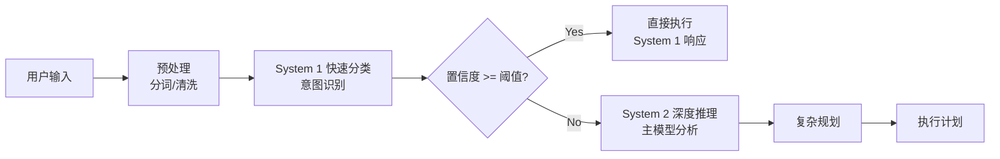

Copyright (c) 2026 SPHARX. All Rights Reserved.
"From data intelligence emerges."

# AgentOS 三层认知运行时 (CoreLoopThree)

**版本**: 1.0.0
**最后更新**: 2026-04-06
**状态**: 生产就绪
**相关原则**: C-1 (双系统协同), C-2 (增量演化), C-3 (记忆卷载), C-4 (遗忘机制)
**核心文档**: [CoreLoopThree架构](../../agentos/manuals/architecture/coreloopthree.md)

---

## 🧠 设计理念

CoreLoopThree 实现了**认知、行动和记忆的有机统一**，是 AgentOS 的"神经系统"。基于双系统认知理论（丹尼尔·卡尼曼《思考，快与慢》）：

> **System 1（快思考）**: 快速、直觉、自动化 → 辅模型快速分类
>
> **System 2（慢思考）**: 缓慢、理性、深度分析 → 主模型深度规划

### 核心循环

```
用户输入
    ↓
┌─────────────────────────────────────────────┐
│              认知层 (Cognition)                │
│   意图理解 → 双模型协同推理                    │
│   System 1: 快速路径（简单任务）               │
│   System 2: 慢速路径（复杂任务）               │
└─────────────────┬───────────────────────────┘
                  ↓
┌─────────────────────────────────────────────┐
│              行动层 (Action/Planning)         │
│   增量规划器(DAG生成) → 调度官(Agent选择)      │
│   执行层(任务执行) → 补偿事务(异常处理)        │
└─────────────────┬───────────────────────────┘
                  ↓
┌─────────────────────────────────────────────┐
│              记忆层 (Memory)                  │
│   结果存储 → 查询检索 → 反馈给认知层           │
│   L1原始卷 → L2特征层 → L3结构层 → L4模式层    │
└─────────────────┬───────────────────────────┘
                  ↓
            反馈闭环（策略调整）
```

---

## 📐 三层架构详解

### 第一层：认知层 (Cognition Layer)

**职责**: 意图理解、任务规划、双模型协同推理

#### System 1 vs System 2 协同

| 维度 | System 1 (快) | System 2 (慢) |
|------|---------------|---------------|
| **触发条件** | 简单任务、高置信度 | 复杂任务、低置信度 |
| **响应时间** | < 100ms | 1-10s |
| **资源消耗** | 低（辅模型） | 高（主模型） |
| **典型场景** | FAQ、简单查询 | 复杂推理、多步规划 |
| **切换阈值** | `f(置信度, 时间预算, 资源约束, 风险等级)` |

#### 切换算法

```python
def should_use_system_2(confidence, time_budget, resource_cost, risk_level):
    """
    切换阈值模型
    threshold = f(置信度, 时间预算, 资源约束, 风险等级)
    """
    base_threshold = 0.8

    # 时间压力调整
    time_factor = 1.0 - (time_budget / max_time_budget) * 0.3

    # 资源约束调整
    resource_factor = 1.0 - (resource_cost / max_resource) * 0.2

    # 风险等级调整
    risk_factor = 1.0 + risk_level * 0.1

    # 计算动态阈值
    dynamic_threshold = base_threshold * time_factor * resource_factor * risk_factor

    return confidence < dynamic_threshold
```

#### 意图识别流程



---

### 第二层：行动层 (Action/Planning Layer)

**职责**: 任务执行、增量规划、补偿事务

#### 增量规划器 (Incremental Planner)

基于 DAG (有向无环图) 的增量式任务规划：

```python
class IncrementalPlanner:
    def __init__(self):
        self.dag = DAG()
        self.execution_state = {}

    def plan(self, goal, context):
        """生成初始执行计划"""
        tasks = self.decompose_goal(goal)
        dependencies = self.analyze_dependencies(tasks)
        self.dag.build(tasks, dependencies)
        return self.dag.get_execution_order()

    def replan(self, completed_tasks, failed_tasks, new_context):
        """根据执行结果动态调整计划"""
        # 移除已完成节点
        self.dag.remove_nodes(completed_tasks)

        # 处理失败节点（重试或替换）
        for task in failed_tasks:
            if task.retries < max_retries:
                self.dag.retry_node(task)
            else:
                alternative = self.find_alternative(task)
                self.dag.replace_node(task, alternative)

        # 插入新任务（如果需要）
        if new_context.requires_new_tasks():
            new_tasks = self.generate_new_tasks(new_context)
            self.dag.add_nodes(new_tasks)

        return self.dag.get_updated_execution_order()
```

#### 调度官 (Scheduler)

Agent 选择与负载均衡：

```python
class AgentScheduler:
    def select_agent(self, task, available_agents):
        """选择最佳 Agent 执行任务"""
        scored_agents = []

        for agent in available_agents:
            score = self.calculate_score(task, agent)
            scored_agents.append((agent, score))

        # 按分数排序，选择最优 Agent
        scored_agents.sort(key=lambda x: x[1], reverse=True)
        return scored_agents[0][0]

    def calculate_score(self, task, agent):
        """计算 Agent 匹配分数"""
        capability_score = agent.capability_match(task.required_capability)
        availability_score = 1.0 - (agent.current_load / agent.max_capacity)
        performance_score = agent.historical_success_rate
        latency_score = 1.0 / (1.0 + avg_latency)

        # 加权综合评分
        total_score = (
            0.4 * capability_score +
            0.3 * availability_score +
            0.2 * performance_score +
            0.1 * latency_score
        )
        return total_score
```

#### 补偿事务 (Compensation Transaction)

异常处理与回滚机制：

```python
class CompensationManager:
    def execute_with_compensation(self, transaction):
        """带补偿的事务执行"""
        executed_steps = []

        try:
            for step in transaction.steps:
                result = step.execute()
                executed_steps.append((step, result))

                # 检查步骤结果
                if not result.success:
                    raise TransactionError(f"Step {step.id} failed")

            return TransactionResult(success=True, data=executed_steps)

        except Exception as e:
            # 补偿事务：逆序回滚已执行的步骤
            logger.error(f"Transaction failed: {e}, starting compensation")

            for step, result in reversed(executed_steps):
                try:
                    step.compensate(result)
                    logger.info(f"Compensated step {step.id}")
                except CompensationError as ce:
                    logger.error(f"Compensation failed for step {step.id}: {ce}")

            return TransactionResult(success=False, error=str(e))
```

---

### 第三层：记忆层 (Memory Layer)

**职责**: 记忆写入、查询检索、经验学习

#### 记忆写入流程

```python
class MemoryWriter:
    def write(self, experience, metadata):
        """将经验写入记忆系统"""
        # L1: 写入原始卷（永久保存）
        raw_record = {
            'id': generate_uuid(),
            'timestamp': time.now(),
            'type': experience.type,
            'data': experience.raw_data,
            'metadata': metadata
        }
        self.l1_store.append(raw_record)

        # L2: 生成向量嵌入
        embedding = self.embedding_model.encode(experience.text)
        l2_record = {
            'id': raw_record['id'],
            'embedding': embedding,
            'metadata': metadata
        }
        self.l2_index.add(l2_record)

        # L3: 关系绑定（异步）
        self.async_task_pool.submit(
            self.l3_processor.bind_relations,
            raw_record['id'],
            experience.entities,
            experience.relations
        )

        # L4: 模式挖掘（批量异步）
        if self.should_trigger_l4_mining():
            self.async_task_pool.submit(self.l4_miner.mine_patterns)
```

#### 记忆查询流程

```python
class MemoryQuerier:
    def query(self, query_text, top_k=10, filters=None):
        """多层级记忆查询"""

        # Step 1: L2 向量相似度检索
        query_embedding = self.embedding_model.encode(query_text)
        candidates = self.l2_index.search(query_embedding, top_k=top_k * 3)

        # Step 2: 应用过滤器
        if filters:
            candidates = [c for c in candidates if self.match_filters(c, filters)]

        # Step 3: L3 结构化关系扩展
        expanded_results = []
        for candidate in candidates[:top_k]:
            related_entities = self.l3_index.get_related_entities(candidate['id'])
            candidate['related'] = related_entities
            expanded_results.append(candidate)

        # Step 4: L4 模式匹配（可选）
        patterns = None
        if self.enable_pattern_matching:
            patterns = self.l4_index.match_patterns(query_text)

        return MemoryQueryResult(
            results=expanded_results[:top_k],
            patterns=patterns,
            latency_ms=self.measure_latency()
        )
```

---

## 🔄 反馈闭环机制

### 实时反馈 (τ < 100ms)

**场景**: 单次任务执行结果返回

```
行动层执行完成
    ↓
结果数据（成功/失败/指标）
    ↓
认知层接收反馈
    ↓
调整当前任务的执行策略
    ↓
继续执行或终止
```

### 轮次内反馈 (τ = 任务周期)

**场景**: 多步骤任务的中间状态更新

```
增量规划器收到已完成的节点
    ↓
DAG 图更新（移除已完成节点）
    ↓
重新评估剩余任务的依赖关系
    ↓
动态插入新任务或调整优先级
    ↓
输出更新的执行计划
```

### 跨轮次反馈 (τ = 会话周期)

**场景**: 从历史会话中学习长期模式

```
L4 模式层从历史轮次挖掘持久模式
    ↓
提取高频成功策略和常见失败模式
    ↓
更新认知层的策略配置
    ↓
影响未来会话的决策质量
```

---

## 📊 性能优化策略

### 1. 缓存机制

| 缓存层级 | 内容 | TTL | 失效策略 |
|----------|------|-----|----------|
| **L1 Cache** | 最近查询结果 | 5分钟 | LRU淘汰 |
| **L2 Cache** | 向量嵌入 | 24小时 | 版本号失效 |
| **L3 Cache** | 关系图谱子图 | 1小时 | 图变更通知 |
| **Strategy Cache** | 成功策略模板 | 7天 | 成功率下降时失效 |

### 2. 并行化

```python
# System 1 和 System 2 并行预计算
async def parallel_cognition(input_text):
    system_1_task = asyncio.create_task(system_1_classify(input_text))
    system_2_task = asyncio.create_task(system_2_analyze(input_text))

    # 先等待 System 1 完成
    s1_result = await system_1_task

    if s1_result.confidence >= threshold:
        # 取消 System 2 任务
        system_2_task.cancel()
        return s1_result
    else:
        # 等待 System 2 完成
        s2_result = await system_2_task
        return merge_results(s1_result, s2_result)
```

### 3. 资源自适应

```python
class ResourceAdaptiveController:
    def adjust_resources(self, current_load, queue_length):
        """根据负载动态调整资源分配"""
        if current_load > 0.8:
            # 高负载：增加 System 1 权重，减少 System 2 使用
            self.increase_system_1_threshold(0.1)
            self.limit_system_2_concurrency(max_concurrent // 2)
        elif current_load < 0.3:
            # 低负载：降低阈值，允许更多任务使用 System 2
            self.decrease_system_1_threshold(0.05)
            self.restore_system_2_concurrency()

        # 动态调整批处理大小
        if queue_length > 100:
            self.increase_batch_size()
        elif queue_length < 10:
            self.decrease_batch_size()
```

---

## 🔧 配置示例

```yaml
# coreloopthree.yaml
coreloopthree:

  cognition:
    # System 1 配置
    system_1:
      model: "fast-model-v1.0"
      max_tokens: 256
      temperature: 0.3
      timeout_ms: 100

    # System 2 配置
    system_2:
      model: "main-model-gpt4"
      max_tokens: 4096
      temperature: 0.7
      timeout_ms: 10000

    # 切换阈值
    switching_threshold:
      base_confidence: 0.8
      time_pressure_weight: 0.3
      resource_cost_weight: 0.2
      risk_level_weight: 0.1

  planning:
    # 增量规划器配置
    planner:
      max_dag_depth: 50
      max_parallel_tasks: 10
      replan_interval_ms: 1000
      retry_limit: 3

    # 调度官配置
    scheduler:
      scoring_weights:
        capability: 0.4
        availability: 0.3
        performance: 0.2
        latency: 0.1
      load_balancing_strategy: weighted_round_robin

  memory:
    # 记忆写入配置
    writer:
      batch_size: 100
      flush_interval_ms: 5000
      async_workers: 4

    # 记忆查询配置
    querier:
      default_top_k: 10
      enable_pattern_matching: true
      l3_expansion_depth: 2

  feedback:
    # 反馈闭环配置
    real_time_enabled: true
    intra_round_enabled: true
    cross_round_enabled: true
    strategy_update_interval_sec: 3600
```

---

## 🧪 测试指南

### 单元测试

```bash
# 运行认知层测试
pytest tests/coreloopthree/test_cognition.py -v

# 运行行动层测试
pytest tests/coreloopthree/test_planning.py -v

# 运行记忆层测试
pytest tests/coreloopthree/test_memory.py -v
```

### 集成测试

```bash
# 端到端测试：完整认知循环
pytest tests/integration/test_full_cognitive_loop.py -v

# 性能基准测试
pytest benchmarks/coreloopthree/benchmark_latency.py
```

### 测试覆盖率要求

| 模块 | 最低覆盖率 | 目标覆盖率 |
|------|-----------|-----------|
| 认知层 | 85% | 90% |
| 行动层 | 80% | 85% |
| 记忆层 | 85% | 90% |
| 反馈闭环 | 75% | 80% |

---

## 📚 相关文档

- **[认知理论](../../agentos/manuals/philosophy/Cognition_Theory.md)** — 双系统认知理论基础
- **[记忆理论](../../agentos/manuals/philosophy/Memory_Theory)** — 记忆分层机制
- **[四层记忆系统](architecture/memoryrovol.md)** — MemoryRovol 技术实现
- **[架构设计原则](../../agentos/manuals/ARCHITECTURAL_PRINCIPLES.md)** — 五维正交原则体系
- **[内核调优指南](../../agentos/manuals/guides/kernel_tuning.md)** — 性能优化实战

---

## ⚠️ 注意事项

1. **System 1/2 切换延迟**: 切换决策本身不应超过 10ms
2. **记忆一致性**: L1-L4 的数据最终一致性保证在 5 秒内
3. **DAG 循环检测**: 规划器必须检测并拒绝循环依赖
4. **补偿幂等性**: 所有补偿操作必须是幂等的
5. **资源隔离**: 不同租户的认知循环应相互隔离

---

**© 2026 SPHARX Ltd. All Rights Reserved.**

*"From data intelligence emerges."*
