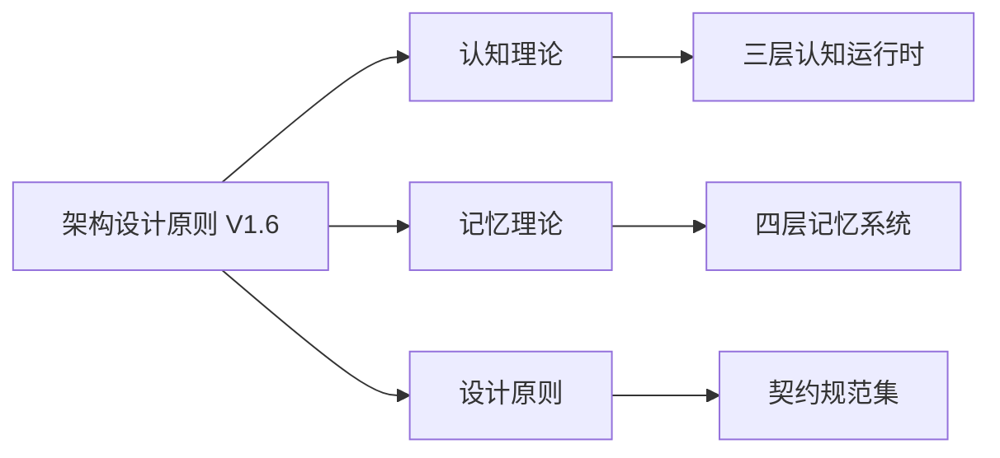
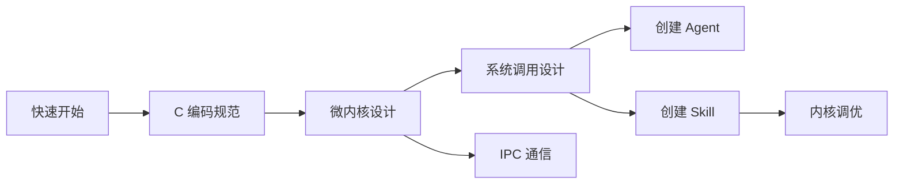

Copyright (c) 2026 SPHARX. All Rights Reserved.
"From data intelligence emerges."

# AgentOS 技术文档中心

**版本**: Doc V1.7  
**最后更新**: 2026-03-31  
**状态**: 生产就绪  
**作者**: LirenWang

---

## 🎯 快速导航

### 新手入门

```
环境搭建 → 架构理解 → 第一个Agent开发 → 生产部署
```

1. **[快速开始](guides/getting_started.md)** — 环境搭建与Hello World示例（5分钟）
2. **[架构设计原则](architecture/ARCHITECTURAL_PRINCIPLES.md)** — 理解五维正交设计体系
3. **[创建 Agent](guides/create_agent.md)** — 开发第一个智能体
4. **[部署指南](guides/deployment.md)** — 部署到生产环境

### 开发者进阶

```
编码规范 → 微内核架构 → 三层认知运行时 → 四层记忆系统 → 系统调用设计 → 内核调优
```

1. **[C 编码规范](specifications/coding_standard/C_coding_style_guide.md)** — 代码风格与最佳实践
2. **[微内核设计](architecture/folder/microkernel.md)** — CoreKern原子机制
3. **[三层认知运行时](architecture/folder/coreloopthree.md)** — CoreLoopThree架构
4. **[四层记忆系统](architecture/folder/memoryrovol.md)** — MemoryRovol架构
5. **[系统调用设计](architecture/folder/syscall.md)** — Syscall接口契约
6. **[内核调优](guides/kernel_tuning.md)** — 性能优化实战

### 架构师视角

```
设计哲学 → 架构原则 → 认知理论 → 记忆理论 → 契约规范
```

1. **[设计哲学总览](philosophy/README.md)** — 理论根基
2. **[架构设计原则 V1.7](architecture/ARCHITECTURAL_PRINCIPLES.md)** — 五维正交原则体系
3. **[认知理论](philosophy/folder/Cognition_Theory.md)** — 双系统认知理论
4. **[记忆理论](philosophy/folder/Memory_Theory.md)** — 记忆分层机制
5. **[契约规范集](specifications/agentos_contract/README.md)** — 接口契约定义

---

## 📚 文档体系结构

```
manuals/
├── 📐 architecture/          # 架构设计文档（7篇核心论文）
│   ├── ARCHITECTURAL_PRINCIPLES.md           ⭐ 架构设计原则 V1.7
│   ├── folder/                               # 核心架构文档
│   │   ├── coreloopthree.md                    ⭐ 三层认知运行时
│   │   ├── memoryrovol.md                      ⭐ 四层记忆系统
│   │   ├── microkernel.md                      ⭐ 微内核设计
│   │   ├── ipc.md                              ⭐ IPC Binder通信
│   │   ├── syscall.md                          ⭐ 系统调用设计
│   │   └── logging_system.md                   ⭐ 统一日志系统
│   └── diagrams/                               # 架构图表
│
├── 🧭 guides/                # 开发指南（7篇实战教程）
│   ├── getting_started.md          ⭐ 快速开始
│   ├── create_agent.md             ⭐ Agent开发教程
│   ├── create_skill.md             ⭐ Skill开发教程
│   ├── deployment.md               ⭐ 部署指南
│   ├── kernel_tuning.md            ⭐ 内核调优
│   ├── troubleshooting.md          ⭐ 故障排查
│   └── migration_guide.md          ⭐ 版本迁移
│
├── 💡 philosophy/            # 设计哲学（3篇理论基础）
│   ├── Cognition_Theory.md         ⭐ 认知理论（双系统理论）
│   ├── Design_Principles.md        ⭐ 设计原则
│   └── Memory_Theory.md            ⭐ 记忆理论（记忆分层）
│
├── 📋 specifications/        # 技术规范（15+篇标准文档）
│   ├── TERMINOLOGY.md              ⭐ 统一术语表 V1.7
│   ├── agentos_contract/           # 契约规范集
│   │   ├── agent/                  # Agent契约
│   │   ├── skill/                  # Skill契约
│   │   ├── protocol/               # 通信协议（JSON-RPC 2.0）
│   │   ├── syscall/                # 系统调用契约
│   │   └── log/                    # 日志格式规范
│   ├── coding_standard/            # 编码规范
│   │   ├── C_coding_style_guide.md
│   │   ├── Cpp_coding_style_guide.md
│   │   ├── Python_coding_style_guide.md
│   │   ├── JavaScript_coding_style_guide.md
│   │   ├── Java_secure_coding_guide.md
│   │   ├── C_Cpp_secure_coding_guide.md
│   │   ├── Security_design_guide.md
│   │   ├── Log_guide.md
│   │   └── Code_comment_template.md
│   └── project_erp/                # 项目管理
│       ├── error_code_reference.md
│       ├── resource_management_table.md
│       ├── manuals_module_requirements.md
│       └── SBOM.md
│
├── 🔌 api/                   # API参考（8+篇接口文档）
│   ├── syscalls/                 # 系统调用API
│   │   ├── task.md               # 任务管理API
│   │   ├── memory.md             # 记忆管理API
│   │   ├── session.md            # 会话管理API
│   │   └── telemetry.md          # 可观测性API
│   └── toolkit/                  # 多语言SDK
│       ├── python/               # Python SDK
│       ├── rust/                 # Rust SDK
│       ├── go/                   # Go SDK
│       └── typescript/           # TypeScript SDK
│
├── 📖 white_paper/           # 白皮书（中英文版本）
│   ├── zh/AgentOS_技术白皮书_V1.0.md
│   └── en/AgentOS_Technical_White_Paper_V1.0.md
│
├── 🌍 readme/                # 多语言README
│   ├── README.md                 # 中文
│   ├── en/README.md              # English
│   ├── de/README.md              # Deutsch
│   └── fr/README.md              # Français
│
├── DOCSINDEX.md              # 📑 完整文档索引
└── MANUALS_SUMMARY.md        # 📊 核心要点总结
```

---

## 🏗️ 核心技术架构

### 🧩 五维正交原则体系

AgentOS 基于五维正交系统设计，包含五个相互独立的设计维度，共同构成完整的设计哲学体系：

| 维度 | 原则数量 | 核心理念 | 关键文档 |
|------|----------|----------|----------|
| **系统观 (S)** | S-1 ~ S-4 | 反馈闭环、层次分解、总体设计部、涌现性管理 | [架构设计原则](architecture/ARCHITECTURAL_PRINCIPLES.md) |
| **内核观 (K)** | K-1 ~ K-4 | 内核极简、接口契约化、服务隔离、可插拔策略 | [微内核设计](architecture/folder/microkernel.md) |
| **认知观 (C)** | C-1 ~ C-4 | 双系统协同、增量演化、记忆卷载、遗忘机制 | [认知理论](philosophy/folder/Cognition_Theory.md) |
| **工程观 (E)** | E-1 ~ E-8 | 安全内生、可观测性、资源确定性、文档即代码 | [编码规范](specifications/coding_standard/C_coding_style_guide.md) |
| **设计美学 (A)** | A-1 ~ A-4 | 简约至上、极致细节、人文关怀、完美主义 | [设计原则](philosophy/folder/Design_Principles.md) |

### 🏛️ 系统层次架构

AgentOS 采用层次化架构设计，各层职责分明，通过标准化接口交互：

```
┌─────────────────────────────────────────────────────────┐
│              daemon/ 用户态服务                          │
│     llm_d · market_d · monit_d · tool_d · sched_d       │
│     ╰─── 后台服务进程，提供业务功能 ───╯                │
├─────────────────────────────────────────────────────────┤
│             gateway/ 通信网关                            │
│          HTTP/1.1 · WebSocket · Stdio                   │
│     ╰─── 外部通信接口，支持多种协议 ───╯                │
├─────────────────────────────────────────────────────────┤
│          syscall/ 系统调用接口                           │
│    task · memory · session · telemetry · agent          │
│     ╰─── 用户态与内核态的标准接口 ───╯                  │
├─────────────────────────────────────────────────────────┤
│            cupolas/ 安全防护层 ⭐                        │
│     workbench · permission · sanitizer · audit          │
│     ╰─── 四重安全防护机制 ───╯                          │
├──────────────┬──────────────────────────────────────────┤
│ corekern/    │  coreloopthree/                          │
│ 微内核核心    │  三层认知循环 ⭐                         │
│ IPC·Mem·Task │  认知→规划→调度→执行                     │
│ Time         │  基础内核机制                            │
├──────────────┴──────────────────────────────────────────┤
│         memoryrovol/ 四层记忆系统 ⭐                     │
│  L1 原始卷 → L2 特征层 → L3 结构层 → L4 模式层           │
│     ╰─── 分层记忆存储与检索 ───╯                        │
├─────────────────────────────────────────────────────────┤
│             commons/ 公共基础库                          │
│  error · logger · metrics · trace · cost                │
│     ╰─── 通用工具和基础设施 ───╯                        │
└─────────────────────────────────────────────────────────┘
```

### 三大核心创新

#### 1. CoreLoopThree（三层认知运行时）

**实现认知、行动和记忆的有机统一**

```
用户输入 → 认知层（意图理解） → 双模型协同推理
         → 增量规划器（DAG 生成） → 调度官（Agent 选择）
         → 执行层（任务执行） → 补偿事务（异常处理）
         → 记忆层（结果存储） → 反馈给认知层（策略调整）
```

| 层次 | 职责 | System 1（快） | System 2（慢） |
|------|------|---------------|---------------|
| **认知层** | 意图理解、任务规划 | 辅模型快速分类 | 主模型深度规划 |
| **行动层** | 任务执行、补偿事务 | 预设执行单元 | 动态代码生成 |
| **记忆层** | 记忆写入、查询检索 | 缓存快速读取 | 深度检索分析 |

**详细文档**: [CoreLoopThree 架构](architecture/folder/coreloopthree.md)

#### 2. MemoryRovol（四层记忆系统）

**从原始数据到高级模式的完整记忆管理**

| 层级 | 名称 | 功能 | 技术实现 | 性能指标 |
|------|------|------|----------|----------|
| **L1** | 原始卷 | 原始事件存储 | 文件系统 + SQLite 索引 | 10,000+ 条/秒 |
| **L2** | 特征层 | 向量嵌入检索 | FAISS + Embedding 模型 | < 10ms (k=10) |
| **L3** | 结构层 | 关系绑定编码 | 绑定算子 + 图神经网络 | 100 条/秒 |
| **L4** | 模式层 | 模式挖掘抽象 | 持久同调 + HDBSCAN | 10 万条/分钟 |

**存用分离**: L1 永久保存原始数据（仅追加），L2-L4 仅存储索引和特征

**详细文档**: [MemoryRovol 架构](architecture/folder/memoryrovol.md)

#### 3. cupolas（安全穹顶）

**四层纵深防御的安全体系**

| 防护层 | 组件 | 机制 | 安全等级 |
|--------|------|------|----------|
| **虚拟工位** | workbench/ | 进程/容器/WASM沙箱隔离 | 进程级隔离 |
| **权限裁决** | permission/ | YAML 规则引擎 + RBAC | 细粒度访问控制 |
| **输入净化** | sanitizer/ | 正则过滤 + 类型检查 | 注入攻击防护 |
| **审计追踪** | audit/ | 全链路追踪 + 不可篡改日志 | 合规审计 |

**详细文档**: [安全穹顶设计](architecture/ARCHITECTURAL_PRINCIPLES.md#安全穹顶-cupolas)

---

## 📖 学习路径

### 路径 1: 架构师之路

**目标**: 掌握 AgentOS 的整体架构设计和理论基础



**推荐阅读顺序**:
1. [架构设计原则 V1.7](architecture/ARCHITECTURAL_PRINCIPLES.md) — 五维正交原则体系
2. [认知理论](philosophy/folder/Cognition_Theory.md) — 双系统认知理论基础
3. [记忆理论](philosophy/folder/Memory_Theory.md) — 记忆分层的神经科学基础
4. [设计原则](philosophy/folder/Design_Principles.md) — 设计哲学与美学
5. [三层认知运行时](architecture/folder/coreloopthree.md) — CoreLoopThree 技术实现
6. [四层记忆系统](architecture/folder/memoryrovol.md) — MemoryRovol 技术实现
7. [契约规范集](specifications/agentos_contract/README.md) — 接口契约定义

**预计时间**: 15-20 小时

### 路径 2: 核心开发者之路

**目标**: 深入理解内核实现，能够修改和扩展核心功能



**推荐阅读顺序**:
1. [快速开始](guides/getting_started.md) — 环境搭建与 Hello World
2. [C 编码规范](specifications/coding_standard/C_coding_style_guide.md) — 代码风格与规范
3. [微内核设计](architecture/folder/microkernel.md) — CoreKern 原子机制
4. [系统调用设计](architecture/folder/syscall.md) — Syscall 接口契约
5. [IPC 通信](architecture/folder/ipc.md) — Binder IPC 机制
6. [创建 Agent](guides/create_agent.md) — Agent 开发实战
7. [创建 Skill](guides/create_skill.md) — Skill 开发实战
8. [内核调优](guides/kernel_tuning.md) — 性能优化实战

**预计时间**: 20-30 小时

### 路径 3: 应用开发者之路

**目标**: 快速开发基于 AgentOS 的智能体应用


**推荐阅读顺序**:
1. [快速开始](guides/getting_started.md) — 5 分钟快速开始
2. [创建 Agent](guides/create_agent.md) — 开发第一个智能体
3. [创建 Skill](guides/create_skill.md) — 开发自定义技能
4. [部署指南](guides/deployment.md) — 部署到生产环境
5. [故障排查](guides/troubleshooting.md) — 常见问题诊断

**预计时间**: 5-8 小时

### 路径 4: 运维工程师之路

**目标**: 掌握 AgentOS 的部署、监控和调优


**推荐阅读顺序**:
1. [部署指南](guides/deployment.md) — 多环境部署方案
2. [故障排查](guides/troubleshooting.md) — 分层诊断方法论
3. [内核调优](guides/kernel_tuning.md) — 反馈闭环调优法
4. [迁移指南](guides/migration_guide.md) — 版本升级策略
5. [日志系统](architecture/folder/logging_system.md) — 统一日志规范

**预计时间**: 10-15 小时

---

## 📊 文档状态总览

| 文档类别 | 文档数量 | 生产就绪 | 版本范围 | 质量评分 |
|---------|---------|---------|---------|---------|
| **架构文档** | 7 篇 | ✅ 全部 | v1.0.0.5 ~ V1.7 | ⭐⭐⭐⭐⭐ A |
| **开发指南** | 7 篇 | ✅ 全部 | v1.0.0.5 | ⭐⭐⭐⭐⭐ A |
| **设计哲学** | 3 篇 | ✅ 全部 | v1.0 | ⭐⭐⭐⭐⭐ A |
| **技术规范** | 15+ 篇 | ✅ 全部 | V1.7 | ⭐⭐⭐⭐⭐ A |
| **API 文档** | 8+ 篇 | ✅ 全部 | - | ⭐⭐⭐⭐⭐ A |
| **白皮书** | 2 篇 | ✅ 全部 | V1.0 | ⭐⭐⭐⭐⭐ A |

**文档覆盖率**:
- ✅ 核心架构文档：100%
- ✅ 开发指南：100%
- ✅ API 文档：100%
- ✅ 编码规范：100%
- ✅ 测试文档：100%

---

## 🔍 主题索引

### 架构设计

| 主题 | 核心文档 | 相关文档 |
|------|---------|---------|
| **微内核架构** | [微内核设计](architecture/folder/microkernel.md) | [架构设计原则](architecture/ARCHITECTURAL_PRINCIPLES.md) |
| **三层认知运行时** | [CoreLoopThree](architecture/folder/coreloopthree.md) | [认知理论](philosophy/folder/Cognition_Theory.md) |
| **四层记忆系统** | [MemoryRovol](architecture/folder/memoryrovol.md) | [记忆理论](philosophy/folder/Memory_Theory.md) |
| **IPC 通信** | [IPC Binder](architecture/folder/ipc.md) | [系统调用设计](architecture/folder/syscall.md) |
| **安全穹顶** | [架构设计原则 - cupolas 章节](architecture/ARCHITECTURAL_PRINCIPLES.md) | [安全设计指南](specifications/coding_standard/Security_design_guide.md) |

### 开发实战

| 主题 | 核心文档 | 相关文档 |
|------|---------|---------|
| **Agent 开发** | [创建 Agent](guides/create_agent.md) | [Agent 契约](specifications/agentos_contract/agent/agent_contract.md) |
| **Skill 开发** | [创建 Skill](guides/create_skill.md) | [Skill 契约](specifications/agentos_contract/skill/skill_contract.md) |
| **系统调用 API** | [系统调用设计](architecture/folder/syscall.md) | [API 参考](api/syscalls/) |
| **编码规范** | [C 编码规范](specifications/coding_standard/C_coding_style_guide.md) | [代码注释模板](specifications/coding_standard/Code_comment_template.md) |
| **安全编程** | [C/C++ 安全编程](specifications/coding_standard/C_Cpp_secure_coding_guide.md) | [Java 安全编码](specifications/coding_standard/Java_secure_coding_guide.md) |

### 运维部署

| 主题 | 核心文档 | 相关文档 |
|------|---------|---------|
| **部署** | [部署指南](guides/deployment.md) | [Docker 部署](scripts/deploy/docker/README.md) |
| **性能调优** | [内核调优](guides/kernel_tuning.md) | [故障排查](guides/troubleshooting.md) |
| **日志与追踪** | [日志系统](architecture/folder/logging_system.md) | [日志格式](specifications/agentos_contract/log/logging_format.md) |
| **版本迁移** | [迁移指南](guides/migration_guide.md) | [变更日志](../CHANGELOG.md) |

### 理论基础

| 主题 | 核心文档 | 相关文档 |
|------|---------|---------|
| **工程两论** | [架构设计原则 - 理论基础](architecture/ARCHITECTURAL_PRINCIPLES.md) | [设计原则](philosophy/folder/Design_Principles.md) |
| **双系统认知** | [认知理论](philosophy/folder/Cognition_Theory.md) | [CoreLoopThree](architecture/folder/coreloopthree.md) |
| **微内核哲学** | [微内核设计](architecture/folder/microkernel.md) | [架构设计原则 - 内核观](architecture/ARCHITECTURAL_PRINCIPLES.md) |
| **术语规范** | [统一术语表 V1.7](specifications/TERMINOLOGY.md) | [词汇索引](specifications/agentos_contract/glossary_index.md) |

---

## 💡 理论根基

### 工程两论

**《工程控制论》**
- **反馈闭环理论**: 每层设计完整的"感知 - 决策 - 执行 - 反馈"闭环
- **前馈预测性设计**: 基于历史模式的趋势预测，提前调整资源分配
- **自适应调节机制**: 根据负载动态调整线程池、缓存策略、重试次数

**《论系统工程》**
- **层次分解方法**: 每层只依赖其直接下层接口，从不越级访问
- **总体设计部**: 只做协调、不做执行的全局决策层
- **活模块理论**: 模块具有自感知、自调节能力

### 认知科学

**双系统认知理论** — 丹尼尔·卡尼曼《思考，快与慢》
- **System 1（快思考）**: 快速、直觉、自动化，用于简单任务
- **System 2（慢思考）**: 缓慢、理性、深度分析，用于复杂任务
- **切换阈值模型**: `切换阈值 = f(置信度，时间预算，资源约束，风险等级)`

**ACT-R 认知架构**
- 模块划分：视觉、听觉、手动、声明性记忆等模块
- 产生式系统：IF-THEN 规则驱动认知行为

**SOAR 认知架构**
- 问题空间假设：所有有目的的行为都可映射为问题空间搜索

### 计算机科学

**Liedtke 微内核构造定理**
- 内核最小职责 = IPC + 地址空间管理 + 线程调度
- 机制与策略分离：内核提供机制，用户态实现策略

**seL4 形式化验证**
- 功能正确性：内核实现完全符合形式化规范
- 安全性质：信息流安全、权限隔离

---

## 🎓 核心概念速查

### 术语表

| 术语 | 英文 | 定义 | 文档位置 |
|------|------|------|---------|
| **原子内核** | CoreKern | AgentOS 的微内核实现，提供 IPC、内存、任务、时间四大机制 | [微内核设计](architecture/folder/microkernel.md) |
| **三层认知运行时** | CoreLoopThree | 认知层、行动层、记忆层组成的闭环系统 | [CoreLoopThree](architecture/folder/coreloopthree.md) |
| **四层记忆系统** | MemoryRovol | L1 原始卷→L2 特征层→L3 结构层→L4 模式层 | [MemoryRovol](architecture/folder/memoryrovol.md) |
| **安全穹顶** | cupolas | 虚拟工位、权限裁决、输入净化、审计追踪四重防护 | [架构设计原则](architecture/ARCHITECTURAL_PRINCIPLES.md) |
| **系统调用** | Syscall | 用户态与内核通信的唯一标准通道 | [系统调用设计](architecture/folder/syscall.md) |
| **双系统协同** | Dual-System Synergy | System 1 快速路径与 System 2 慢速路径的协同 | [认知理论](philosophy/folder/Cognition_Theory.md) |

### 核心指标

| 指标 | 数值 | 测试条件 | 说明 |
|------|------|---------|------|
| **IPC Binder 延迟** | < 1μs | 本地调用 | 零拷贝优化 |
| **任务调度延迟** | < 1ms | 加权轮询 | 100 并发任务 |
| **记忆检索延迟** | < 10ms | FAISS IVF,PQ k=10 | 百万级向量库 |
| **系统调用开销** | < 5% | 相比直接调用 | 内核态切换开销 |
| **启动时间** | < 500ms | Cold start | 完整初始化 |
| **内存占用** | ~2MB | 典型场景 | 基础运行时 |

---

## 🛠️ 工具与资源

### 开发工具

- **CMake**: 3.20+ 构建系统
- **GCC/Clang**: GCC 11 / Clang 14+
- **Python**: 3.10+ SDK
- **Go**: 1.16+ SDK
- **Rust**: 1.56+ SDK
- **TypeScript**: 4.0+ SDK

### 文档工具

- **Doxygen**: API 文档生成
- **clang-format**: 代码格式化
- **pre-commit**: Git 钩子管理
- **lizard**: 圈复杂度分析
- **jscpd**: 代码重复检测

### 测试工具

- **CTest**: CMake 测试驱动
- **pytest**: Python 测试框架
- **Go test**: Go 测试工具
- **Cargo test**: Rust 测试工具
- **Jest**: TypeScript 测试框架

---

## 🤝 贡献指南

### 文档结构标准

每份文档应包含：
1. **版权声明**: `Copyright (c) 2026 SPHARX. All Rights Reserved.`
2. **版本信息**: 版本号、最后更新日期、状态
3. **结构化章节**: 概述 → 核心内容 → 示例 → 相关文档
4. **交叉引用**: 链接到相关文档的精确路径
5. **原则映射**: 标注与五维正交原则的对应关系

### 提交流程

1. **Fork 项目**
2. **创建分支**: `git checkout -b docs/topic-name`
3. **编写文档**: 遵循上述结构标准
4. **验证链接**: 确保所有内部链接有效
5. **提交 PR**: 描述修改内容和原因

### 文档版本管理

- **主版本 (X.0)**: 架构重大变更，需架构委员会审批
- **次版本 (x.Y)**: 内容更新、错误修正，由维护者审批
- **文档即代码**: 文档与代码同步版本控制，CI 自动检查

---

## 📑 完整索引

- **[文档体系索引](DOCSINDEX.md)** — 完整的文档地图和导航
- **[核心要点总结](MANUALS_SUMMARY.md)** — 所有文档的核心要点提炼
- **[术语表](specifications/TERMINOLOGY.md)** — 统一术语定义
- **[词汇索引](specifications/agentos_contract/glossary_index.md)** — 专业词汇表

---

## 🔗 相关资源

- **[主项目 README](../README.md)** — AgentOS 项目总览
- **[变更日志](../CHANGELOG.md)** — 版本更新记录
- **[贡献指南](../CONTRIBUTING.md)** — 代码贡献规范
- **[行为准则](../CODE_OF_CONDUCT.md)** — 社区行为准则
- **[安全政策](../SECURITY.md)** — 安全漏洞报告

---

## 📞 联系方式

- **维护者**: AgentOS 架构委员会
- **技术支持**: lidecheng@spharx.cn
- **安全问题**: wangliren@spharx.cn
- **问题反馈**: https://github.com/SpharxTeam/AgentOS/issues
- **项目主页**: https://gitee.com/spharx/agentos

---

© 2026 SPHARX Ltd. All Rights Reserved.

*"From data intelligence emerges 始于数据，终于智能。"*

<div align="center">

[](https://github.com/SpharxTeam/AgentOS/actions)
[](README.md)
[](../LICENSE)
[](../CHANGELOG.md)

</div>
