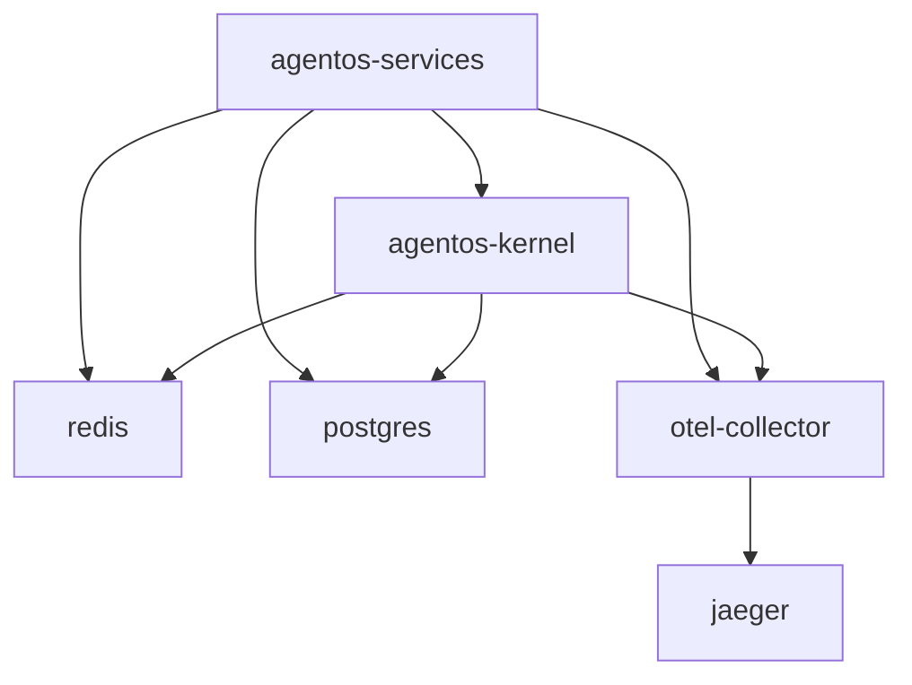

# AgentOS Docker 部署指南

**版本**: 1.0.0.5  
**最后更新**: 2026-03-20  
**维护者**: SPHARX Team <lidecheng@spharx.cn>

---

## 📋 目录结构

```
scripts/docker/
├── README.md                  # 本文档
├── build.sh                   # 镜像构建脚本
├── docker-compose.yml         # 容器编排配置
├── Dockerfile.kernel          # 内核镜像构建文件
└── Dockerfile.service         # 服务镜像构建文件
```

---

## 🚀 快速开始

### 1. 环境要求


<!-- From data intelligence emerges. by spharx -->
- **Docker**: 20.10+
- **Docker Compose**: 2.0+
- **操作系统**: Linux (Ubuntu 22.04+), macOS 13+, Windows 11 (WSL2)
- **硬件要求**:
  - CPU: 4 核以上（推荐 8 核）
  - 内存：8GB 以上（推荐 16GB）
  - 存储：50GB 可用空间

### 2. 构建镜像

#### 方式一：使用构建脚本（推荐）

```bash
# 进入 docker 目录
cd AgentOS/scripts/docker

# 赋予执行权限
chmod +x build.sh

# 构建所有镜像（生产版本）
./build.sh all release

# 或构建开发版本（包含调试工具）
./build.sh all dev

# 单独构建内核镜像
./build.sh kernel release

# 单独构建服务镜像
./build.sh service release
```

#### 方式二：手动构建

```bash
# 构建内核镜像
docker build \
  -f Dockerfile.kernel \
  -t spharx/agentos-kernel:1.0.0.5 \
  --target runtime \
  ../../

# 构建服务镜像
docker build \
  -f Dockerfile.service \
  -t spharx/agentos-services:1.0.0.5 \
  ../../
```

### 3. 启动服务

```bash
# 使用 docker-compose 启动所有服务
docker-compose up -d

# 查看服务状态
docker-compose ps

# 查看日志
docker-compose logs -f

# 停止所有服务
docker-compose down

# 停止并删除数据卷
docker-compose down -v
```

---

## 🏗️ 架构说明

### 镜像层次结构

```
┌─────────────────────────────────────┐
│   spharx/agentos-services:1.0.0.5   │  ← 服务层镜像
│   - LLM 服务 (llm_d)                 │
│   - 工具服务 (tool_d)                │
│   - 市场服务 (market_d)              │
│   - 调度服务 (sched_d)               │
│   - 监控服务 (monit_d)               │
└─────────────────────────────────────┘
                    ↓
┌─────────────────────────────────────┐
│   spharx/agentos-kernel:runtime     │  ← 内核运行时镜像
│   - CoreLoopThree 核心运行时          │
│   - MemoryRovol 记忆系统             │
│   - Syscall 系统调用层                │
│   - IPC Binder 通信机制              │
└─────────────────────────────────────┘
                    ↓
┌─────────────────────────────────────┐
│   ubuntu:22.04                      │  ← 基础镜像
└─────────────────────────────────────┘
```

### 服务依赖关系



---

## ⚙️ 配置说明

### 环境变量配置

创建 `.env` 文件（参考 `.env.example`）：

```bash
# API 密钥
OPENAI_API_KEY=sk-your-openai-key
DEEPSEEK_API_KEY=sk-your-deepseek-key
ANTHROPIC_API_KEY=sk-your-anthropic-key

# 数据库密码
POSTGRES_PASSWORD=your-postgres-password

# 日志级别
AGENTOS_LOG_LEVEL=INFO

# 追踪端点
AGENTOS_TELEMETRY_ENDPOINT=http://otel-collector:4317
```

### 数据卷挂载

| 宿主机路径 | 容器路径 | 用途 |
|-----------|---------|------|
| `./partdata/logs` | `/var/log/agentos` | 日志存储 |
| `./partdata/registry` | `/var/lib/agentos/registry` | 注册表数据 |
| `./partdata/traces` | `/var/lib/agentos/traces` | 追踪数据 |
| `../../config/kernel` | `/etc/agentos/kernel` | 内核配置 |
| `../../config/services` | `/etc/agentos/services` | 服务配置 |

### 端口映射

| 端口 | 服务 | 说明 |
|-----|------|------|
| 8080 | LLM 服务 | OpenAI 兼容 API |
| 8081 | 工具服务 | 工具注册和执行 |
| 8082 | 市场服务 | Agent/Skill 市场 |
| 8083 | 调度服务 | 任务调度接口 |
| 8084 | 监控服务 | 指标和告警 |
| 16686 | Jaeger UI | 分布式追踪查看 |
| 8888 | Prometheus | 指标导出 |

---

## 🔧 高级用法

### 1. 开发模式

```bash
# 构建开发镜像（包含 gdb、valgrind 等调试工具）
./build.sh kernel dev

# 以交互模式启动容器
docker run -it --rm \
  -v $(pwd)/partdata/logs:/var/log/agentos \
  -v $(pwd)/config:/etc/agentos \
  spharx/agentos-kernel:dev \
  /bin/bash
```

### 2. 性能调优

编辑 `docker-compose.yml` 调整资源限制：

```yaml
services:
  agentos-kernel:
    deploy:
      resources:
        limits:
          cpus: '8.0'    # 增加 CPU 配额
          memory: 16G     # 增加内存
```

### 3. 多环境部署

```bash
# 开发环境
docker-compose -f docker-compose.yml -f docker-compose.dev.yml up -d

# 生产环境
docker-compose -f docker-compose.yml -f docker-compose.prod.yml up -d
```

### 4. 健康检查

```bash
# 检查所有服务健康状态
docker-compose ps

# 检查特定服务
docker inspect --format='{{.State.Health.Status}}' agentos-kernel

# 等待服务就绪
docker-compose exec agentos-kernel pgrep -x agentos
```

---

## 📊 监控和日志

### 查看日志

```bash
# 查看所有服务日志
docker-compose logs -f

# 查看特定服务日志
docker-compose logs -f agentos-kernel

# 查看最近 100 行
docker-compose logs --tail=100 agentos-services

# 查看时间戳
docker-compose logs -t agentos-kernel
```

### 访问监控面板

```bash
# Jaeger 追踪 UI
open http://localhost:16686

# Prometheus 指标
open http://localhost:8888/metrics
```

### 进入容器调试

```bash
# 进入内核容器
docker-compose exec agentos-kernel /bin/bash

# 进入服务容器
docker-compose exec agentos-services /bin/bash

# 查看容器内进程
docker-compose exec agentos-kernel ps aux
```

---

## 🛠️ 故障排查

### 常见问题

#### 1. 镜像构建失败

```bash
# 清理构建缓存
docker builder prune -a

# 重新构建
./build.sh clean
./build.sh all release
```

#### 2. 容器无法启动

```bash
# 查看详细错误
docker-compose logs agentos-kernel

# 检查配置文件
docker-compose config

# 验证网络
docker-compose exec agentos-kernel ping redis
```

#### 3. 服务间通信失败

```bash
# 检查网络配置
docker network ls
docker network inspect docker_agentos-network

# 重启网络
docker-compose down
docker network rm docker_agentos-network
docker-compose up -d
```

#### 4. 数据持久化问题

```bash
# 检查数据卷
docker volume ls
docker volume inspect docker_redis-data

# 备份数据
docker run --rm \
  -v docker_redis-data:/data \
  -v $(pwd):/backup \
  alpine tar czf /backup/redis-backup.tar.gz /data
```

---

## 📈 性能优化

### 1. 使用 BuildKit 加速构建

```bash
export DOCKER_BUILDKIT=1
export BUILDKIT_PROGRESS=plain

# 或使用 buildx
docker buildx build \
  -f Dockerfile.kernel \
  -t spharx/agentos-kernel:latest \
  --load \
  ../../
```

### 2. 镜像层缓存优化

在 `Dockerfile` 中合理安排指令顺序，将变化频繁的指令放在后面。

### 3. 使用国内镜像源

编辑 `/etc/docker/daemon.json`：

```json
{
  "registry-mirrors": [
    "https://docker.mirrors.ustc.edu.cn",
    "https://registry.docker-cn.com"
  ]
}
```

---

## 🔒 安全建议

### 1. 非 root 用户运行

所有容器均使用非 root 用户运行，提升安全性。

### 2. 只读文件系统

```yaml
services:
  agentos-kernel:
    read_only: true
    tmpfs:
      - /tmp
      - /var/log
```

### 3. 资源限制

确保所有服务都配置了资源限制，防止资源耗尽。

### 4. 网络安全

```bash
# 限制网络访问
docker network create --internal agentos-internal
```

---

## 📝 许可证

Apache License 2.0 © 2026 SPHARX Ltd. All Rights Reserved.

---

## 🤝 贡献指南

欢迎提交 Issue 和 Pull Request！

**项目主页**: [AgentOS GitHub](https://github.com/SpharxTeam/AgentOS)  
**技术支持**: lidecheng@spharx.cn

---

<div align="center">

**SPHARX极光感知科技**

*"From data intelligence emerges"*  
*"始于数据，终于智能"*

© 2026 SPHARX Ltd. All Rights Reserved.

</div>
